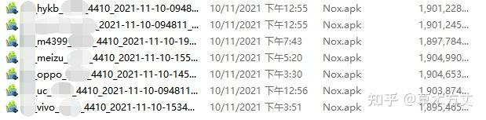
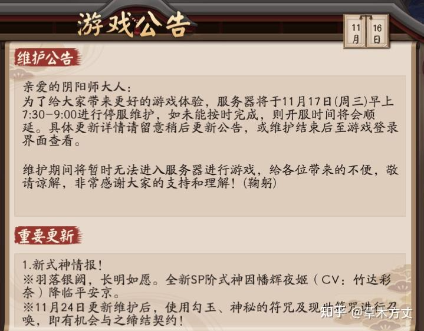
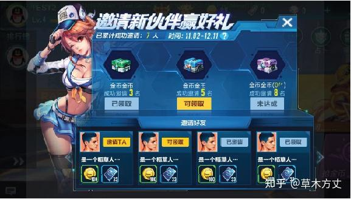
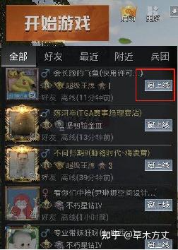
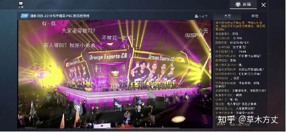
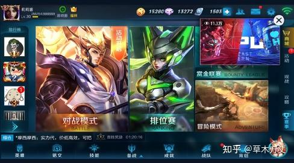
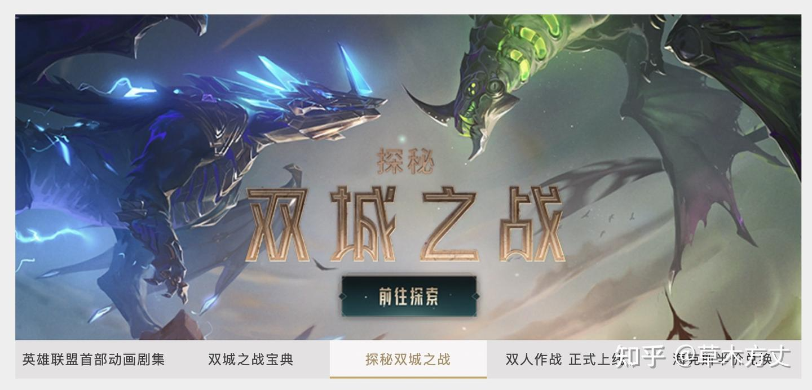
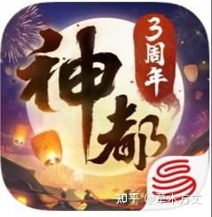
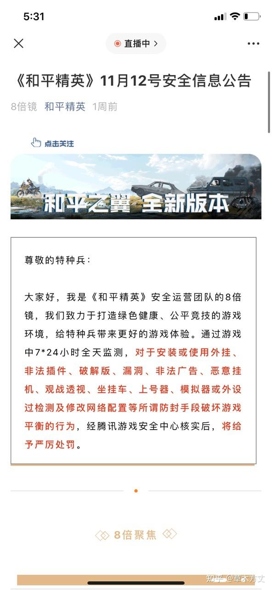
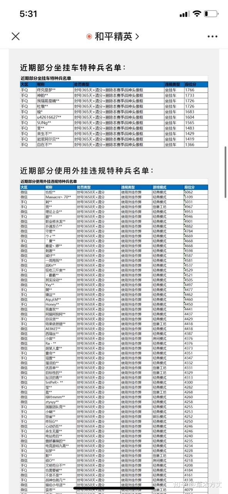

# 《游戏版本运营：从入门到高阶》

原文编辑于 2022-01-21

[《游戏版本运营：从入门到高阶》](https://zhuanlan.zhihu.com/p/433635568)

本文主要围绕“游戏版本运营”这个岗位，讲讲日常工作中需要负责的事情以及对这个工作岗位的一些理解。

游戏版本运营，在一些团队也叫“运营策划”，有的也叫“产品运营”。但总之核心工作职责是对游戏版本负责，帮助产品迭代调优，变得更好。

本文主要是将这个岗位拆成两部分来讲，分为<u>“版本维护”</u>和<u>“版本运营”</u>。

这么拆的依据主要是；

1.**版本维护**的事情偏入门向，对能力的要求相对低一些，都是些偏基础性的工作，更适合新人做

2.**版本运营**的事情更高阶，需要有足够的运营综合能力以及对游戏的理解来作为支持，更适合有一定工作经验的同学来负责

一个游戏运营团队既需要能力强一点的同学来做版本运营的工作，也需要一些新人来协助完成一些版本维护的事情，这样是一个比较健康合理的配合结构。

  

## 一、版本维护
  

版本维护这一部分工作相对来说更重执行，需要基本的工作经验能将这些事情准确无误的落实好就行。相比版本运营来说，需要自我思考及完全负责任的会少一些。

  

### 1.1 日常多版本管理
多版本的意思是指，通常玩家看到一款游戏的时候，它就只是普普通通的一款游戏，一个APP。但在游戏运营团队的眼里，它却可能会有很多“分身”。

对于游戏运营团队来说，这些“分身”主要是因为有不同渠道、不同地区、不同服务器的存在所导致。

例如一款手游《手游》，它可能会有官网包、华为包、oppo包、vivo包、小米包等。搞这么麻烦的原因是为了便于玩家能在更多的地方随意下载到游戏，比如你可以在苹果商店下，你可以在应用宝下，你可以在华为应用商店下，你可以在官网下等等，因为涉及到不同的“销售渠道”，在业内不同的“销售渠道”有不同的政策和技术开发要求（账号SDK等），所以即使是同一款游戏，开发团队也需要针对性的做不同版本，而这么多版本对应着不同的客户端资源、服务器资源等都需要单独处理，并且不能出错，这里就涉及到大量的版本维护工作。

一个游戏的多个客户端

同时，除了不同渠道导致的多个版本原因外，还有可能因为游戏发行策略导致出现多个版本的存在。例如《手游》的国内版，港澳台版，东南亚版，欧美版等等，都是会出现同一款游戏其实有多个版本的情况。

尤其强调一点，发海外版的多语言资源（给不同地区玩家看的语言总得有对应的语言版本吧）维护起来是真的费事儿。

总之以上，玩家看到的一款普通游戏，对于游戏运营团队来说，很有可能需要维护多个版本，对应的不同版本号、不同客户端资源、服务器资源如何匹配上不搞错，每次更新更哪些，怎么更，把这些理清楚，就是版本维护的很重要工作一部分。

  

### 1.2 GM后台的使用和迭代需求发起
每个游戏都会有一个自己GM管理后台用来管理游戏服务器中的部分数据和信息（有的信息还是只能服务器在后端处理），游戏运营人员也是通过这个GM后台来管理整个游戏世界的。

GM后台主要可以管理和操作的部分如下：

①.玩家信息管理（诸如改名、封禁、道具发放或删除、邮件发放、流水订单查询等基础的玩家信息管理）

②.服务器资源管理（全服邮件、APP PUSH、图文公告配置、商城广告图等服务器的资源管理）

③.游戏功能管理（全服开启/关闭匹配、部分功能的开启/关闭、资源版本号管理、白名单等）

主要功能包含如上，可能有的团队也会把商城道具配置、活动信息配置等也合并在GM后台来一起处理。

所以要想做好对整个游戏的运营管理，熟练、准确的使用项目的GM后台也是作为版本维护的基本技能之一。（这一块是犯错的重灾区！！！）

接着这一块的事情就是，作为最常使用这个管理后台的人员，一定会在日常业务中发现很多“想做但做不了的事情”、“很影响工作效率的问题”，**<u>所以怎么通过提需求去完善GM后台的功能迭代，以提升自己的运营管理手段和效率，也是作为版本维护的基础工作内容之一</u>**。

  

### 1.3 版本测试及QA/QC对接工作
一般来说，在版本研发测试阶段，版本运营的同学就需要介入其中，包括不限于自己对一些新功能的测试验收、协助测试同学在QA服做一些资源配置以便测试等。

**<u>这里尤其要强调的是，特别是运营自己提的需求，一定要积极参与验收</u>**，否则上线后你会被你提的需求实际呈现出来的效果气的要死（血泪经验）。

除此之外，还有可能会因为一些测试验收流程问题，之前的一些问题复盘总结，会和其他部门的同事进行一些对接和梳理规范的工作。总之一个成熟的运营团队要有一套自己的开发、测试、更新发布流程。

*_QA_（QUALITY ASSURANCE）

*_QC_（QUALITY CHECK）

  

### 1.4 版本更新发布及相关流程梳理
游戏的每个大大小小的版本更新发布，是一个比较冗长的环节，其中涉及到多部门多责任人多个细节工作的确认，就像一条长长的工厂流水线，其中任一环节出错都有可能会导致一次极大的运营事故，从而对玩家的体验造成极大影响。所以对于游戏的版本更新发布，整个团队也是需要梳理出对应的标准化的工作流程，以确保每个部门每个责任人在每次更新发布时，都知道自己应该要在什么环节做什么事，自己的工作上下游都分别是谁。（这个流程就不仅限于运营）

流程大致参考如下（每个团队情况不同）：

①.停服更新前需要做的事情（通知玩家什么时候更新，怎么更新，更什么东西，多久关匹配，多久不再允许登录游戏，内部多久踢玩家下线等，工作对应处理人都分别是谁）

②.停服更新开始以后，客户端、服务器、运维怎么协同工作，谁先更什么资源再通知谁更什么之类的流程以及对应处理人都分别是谁

③.内网验证阶段（客户端、服务器资源版本号验证、更新内容验证、所有发布内容检查，对应处理人都分别是谁）

④.预发布环境部署及验证阶段（和内网的环境不同，另一套无限接近于线上正式服的环境）

⑤.运营确认环节（相关公告、跑马灯、邮件、发布内容和开服时间确认），有的地方可能涉及一些传包的工作，比如传到官网、或者其他的一些平台。（大多数外部渠道已经提审通过了）

⑥.线上正式服发布部署

⑦.线上正式服验证（同之前验证阶段一致，这个阶段是通过开白名单，内部人员提前进正式服验证）

⑧.开服

⑨.维护补偿发放

⑩.更新过程中可能遗留的问题汇总并交接给后续跟进的同事，关注更新后线上反馈

流程的具体细节视每个团队不同的情况会有不同，也会随着项目迭代历程中遇到的各种问题不断调优，但核心本质是，一定要有标准化的流程来帮助大家一起协同工作，保证不出错。更新发布过程禁不起出错。

  

### 1.5 撰写日常更新公告
写公告是作为运营（不仅是版本运营）的最最最基本的技能之一，这是一个看起来简单但做起来能非常明显看出一个运营同学靠不靠谱的工作。

写公告最基础考验的是细心程度（错别字）和逻辑表达能力（能不能在公告里把事儿说明白）。其次是公告内容的准确性，通常在内部开发环境中经常有很多干扰信息，什么改了什么没改，改了的是怎么改的，又有什么调整没有，这些都是需要反复确认的，否则对外的公告信息一旦有误也会造成极为不好的影响。

其次，做到以上几点后，还有额外需要注意的事项。就是现在很多游戏多极为注重包装，从游戏内到游戏外各个角落都是与世界观/剧情相匹配的文案包装，所以公告也不例外。对于公告内容本身的一些用词也不见得是只需要“亲爱的玩家”如此即可，而是对于整个的文案能力、文风都有更高的要求，这也是对于版本运营同学的文案包装能力提出了更高的要求。

[[活动预告]2021「感谢庆典」限时活动即将开启ak.hypergryph.com/news/2021100428.html](https://link.zhihu.com/?target=https%3A//ak.hypergryph.com/news/2021100428.html)

[https://pvp.qq.com/web201706/newsdetail.shtml?tid=538793pvp.qq.com/web201706/newsdetail.shtml?tid=538793](https://link.zhihu.com/?target=https%3A//pvp.qq.com/web201706/newsdetail.shtml%3Ftid%3D538793)

除此之外，写公告还有一个地方需要注意的是，游戏运营过程中，经常会有一些突如其来的紧急更新，需要立即安排，这个时候会要求到运营能够赶紧出公告，不可能整个开发团队就绪以后都在这等你写公告。

所以为了提升效率，在公告这一块，平时就需要针对可能会发生的不同情况，准备好不同公告的模板，在紧急情况下能只需要基于公告模板做一些小小改动就能立即发布。

对于一些全球运营或仅限于海外运营的项目，公告还涉及到多语言这一部分，所以不同语种的公告模板也是需要常备的内容之一，而且哪怕是基于不同语种的公告模板去进行修改也是很容易出现改错的情况（因为不同语言修改时涉及到不同的语法、语序等），这个需要平时和负责多语言的同学多沟通，直到熟练理解为止。

  

### 1.6 熟悉主流市场渠道上架相关流程
每到涉及换包更新时，负责版本的同学都需要将最新版本的客户端上传到不同应用商店开发后台进行提审，这几块看起来是很简单的操作，但也蕴藏了诸多可能犯错的点：

①.内部给提审包的时候记得确认是否已走完内部所有测试流程，切忌未完全确认就拿着什么debug包、尚未验收完全的包去提审

②.因为涉及多渠道，经常一次性发多个包给运营提审，一定要分清楚，不要把不同渠道包搞混了

③.商店更新涉及到的文字、图片、资质文件相关的物料记得提前准备并替换

④.提审后被打回的常见问题要知道如何处理，问题要及时反馈给PM或开发团队

⑤.过审后是立即发布还是定时发布需要确认好，一般来说提审时设置的发布时间都不太好修改，也就是提审之前要确认好最终的更新时间

非第一次提审的情况下，IOS审核可能会要1-5天，一般2/3天就能有结果

非第一次提审的情况下，国内常规安卓渠道审核时间也多为2天左右（可能私下单独联系渠道商务勾兑）

非第一次提审的情况下，谷歌渠道一般都是提审后秒过秒发布，这有点不同需要特殊注意

⑥.发布之前注意将提审服切为正式服！！！这个忘了要犯大错

  

以上主要是常规的手游渠道，如果有做PC版的话，还会涉及诸如epic、steam、wegame等平台的提审，操作又有一些不同，这一块主要是在传包上会话费很多时间，需要提前考虑到。

在更新环节，最好能让开发团队提供差分算法，即更新的时候玩家只需要更新新版本这一小部分资源，而不需要更整包，对于玩家来说更新体验会好很多。（比如更新每次是40M、80M、1个G，会比无论更新什么每次都是要下载55G的整包资源好）

除了上传提审新版本客户端外，还会涉及到在商店后台配置一些常见的支付项、获取一些开发需要的参数、回调地址等等。

  

### 1.7 外网问题监控、反馈、处理
首先外网问题监控这一块的工作目标主要是除了通过服务器数据统计之外，从玩家的反馈去关注目前线上版本的质量，属于版本质量保证的工作。这一块这里就不赘述舆情监控如何做，有需要可参考“前文第三章部分”：

[草木方丈：游戏社区运营这点活儿，真就给他玩明白了？（上）75 赞同 · 9 评论文章](https://zhuanlan.zhihu.com/p/424070135)

无论是通过外网舆情监控、还是客服反馈、还是接入的什么AI智能系统，在收集到从玩家侧反馈的游戏问题后，版本维护的同学就要开始跟进这一系列问题的处理，主要包含：

①.接收问题并记录

②.评估问题重要性、分析问题解决方法、并通知到需要配合的同事

③.将问题的解决结果、解决进度、暂时无法解决的原因、**<u>答复玩家的口径</u>**回复给负责用户运营、社区运营、客服的同学

④.关注当前所有问题池的解决进度，对当前版本质量要有个数

⑤.定期分析过往出现的问题，将问题涉及到的原因/处理方法进行归类总结，经验沉淀，提升整个团队的能力

这部分工作想要做好需要尤为注意的是：

①.以上提到的工作涉及一个很长的配合流程线，涉及多部门多职位多信息传递，所以需要结合实际工作情况梳理建立足够清晰的工作流程，才能保证在这个工作链上的每一环不出问题

②.对于反馈问题、解决问题需要的最基础/最常见的信息类别做好模板（诸如昵称、ID、区服、问题发生时间、问题描述、设备型号、系统版本之类的常见信息），这样不用在解决问题的过程中反复索要玩家信息，重复无数次，耽误问题解决进度。有的时候某个问题是影响很多玩家的，但很有可能只有为数不多的玩家来反馈了，需要他们提供关键信息给我们帮助我们定位问题。如果因为差什么信息，又一直联系不上玩家，所有问题解决进度就卡住了，就很麻烦。

  

### 1.8 游戏内资源位排期管理
简单来说就是游戏内的各个拍脸图、loading图、轮播图、图文公告等“广告资源位”。因为资源位有限，活动运营的同学想宣传自己的活动，社区同学想宣传自己的社区，市场同学想宣传自己的市场活动，赛事同学想宣传自己的赛事，外部合作伙伴想宣传自己的平台信息…… 这么多信息到底推啥，先推谁后退谁，谁的展示优先级更高？怎么配置才不会让玩家体验差，看着反感？这需要有相关的策略去管理这些资源位的使用。

以上说的是资源多的安排不过来的困扰，但有的时候又会出现都没什么要推的，游戏内的各个“广告资源位”甚至出现了空白的情况，也是资源利用率低下的体现，这种时候有如何填补空缺？也是需要思考的。

  

### 1.9 最新政策解读及需求执行推进
尤其是以21年下半年为例，整个游戏市场时不时的都会面临一些突如其来但不得不执行的政策，不管是隐私政策，还是新的防沉迷系统接入等等，有的时候是苹果、谷歌自己的一些框架协议调整之类的需求。因为在现有的开发节奏上额外去接一些sdk或者开发一些功能都会打乱我们既定的版本开发计划，所以如何去敏锐的捕捉市场上“招招致命”的政策变化，如何评估各个需求需要接入的优先级和重要性，以及具体的接入过程跟进，也是版本维护同学需要重点关注的工作。

  

### 1.10 平台能力接入
这部分可能更多是出现在和一些平台能力强的发行商合作的时候会涉及的工作，比如你们是一个小cp，现在要交给腾讯发行，那这个时候就会涉及到很多平台能力的接入，比如手Q/微信登录、各种社交关系链、分享功能、组队功能、直播功能、会员特权等等。

举例：

潘多拉-好友召回

组队开黑

直播

最小化播放

这部分接入工作虽然主要是开发在负责，但是运营同学需要在其中跟进双方的需求对接、需求文档产出以及接入过程中涉及到的各种参数、信息传递，最后负责验收功能。

  

## 二、版本运营
  

如前文所说，接下来版本运营这一部分的工作在基于高执行力的基础上，需要更多的思考和承担责任。

  

### 2.1 参与版本迭代规划制定
一款游戏在研发阶段，它的游戏性更多是由策划团队决定。但是在上线以后，后续的版本开发规划就需要足够的重视来自运营团队的意见，甚至有的团队会在上线后完全由运营来主导。因为运营更知道玩家对于游戏的反馈是如何的，每一个运营数据的变化趋势是如何的，综合这两者能分析出相对更合适的开发方向和节奏。（前提是运营能力达标）

所以这对负责版本运营的同学提出了更高的要求，首先要懂游戏懂玩家反馈，其次要懂数据分析，要能从两者中汇总出真正有效可行的建议，并梳理成运营需求文档进行排期讨论。

部分项目在上线后也并没有太按照运营的建议来进行版本开发，主要有两个原因：

①.运营团队能力不足

②.这个项目/这个团队/这个公司/制作人或老板比较特殊，运营battle不动。这个就是每个地方有每个地方的特殊性。

  

### 2.2 体验服版本内容规划与排期
对于版本内容排期这部分和上一小节一致，不多讲了。

这里主要讲一下测试服/先行服/体验服（名字只是形式）的重要性。

以我自己曾在的项目经历为例，开始一段时间因为版本赶进度来不及走体验服体验流程，都是内网验证完了直接上正式服，那段时间正式服的更新都不是很理想。直到某一个阶段团队痛定思痛重新调整版本规划后，启用体验服，任何要上正式服的游戏内容都会提前2周——一个月上体验服，收集玩家反馈调优，提前验证bug处理，随后的版本普遍版本质量、玩家满意度都明显高了不少。

测试服/先行服/体验服（名字只是形式）对于为正式服提供一个更有把握的版本，能起到非常非常非常重要的作用。

唯一的难点是，体验服的用户量比较少，想把大家去体验服试玩的积极性调动起来是有难度的。

在体验服内容排期这方面，绝大多数基本上都还是会以接下来马上要上的版本内容为主，偶尔会开一些按计划离上线还有一段时间的内容在里边测试。

  

### 2.3 体验服内容到正式服版本的调优与开发
在理解到体验服的重要性后，还有一个工作难点就是：

<u>即使在体验服验证过程中，发现了一些可能需要调整的点，那我们调不调？来不来得及调？</u>

这个很重要。因为如果你对体验服发现的一些问题不做任何调整依然原封不动的搬上正式服，那验证的过程就是没有意义的，久而久之，参与测试的玩家积极性也将大幅下降，因为他们会明白反馈是没有意义的。

说回来，可能会有人觉得，那就调呗，多简单一事儿。

然而实际上，并不简单。不简单在于：

①.普遍上体验服反馈出来的一些问题（除bug外）都是比较主观的，这个玩法好不好因人而异，而负责策划的同学一般都会认为自己设计的系统/玩法肯定是没有问题的，让玩家多体验体验，多适应适应就好了，所以就不想改。那这里就会产生一定的意见冲突，那到底改不改呢？所以这个时候版本运营的同学就需要深入思考一下，到底玩家的反馈是对的还是策划坚持的想法是对的，如何拿数据或者有力的依据来下判断并说服对方，说服自己呢？

②.即使大家意见达成一致，要改！但PM会告诉你，不好意思，客户端/服务器同学评估了一下来不及了，改不动。所以这里又会涉及到整个版本开发排期中的时间问题，又得拉上相关干系人梳理这一块，怎么把体验服的体验时间给留出来。

所以即使理解到体验服的重要性后，能不能把这坨利用起来，利用好，是另外一个坎。

  

### 2.4 评估版本发布风险
通常来说，在每个版本（尤其是大版本）开发测试工作完成后，QA部门会出具一个版本质量评审的报告，结论是根据他们在新版本测试验收工作中发现的致命/严重/一般/轻度bug数量以及核心功能的完成度来出的，当这个结论给到PM和运营的时候，需要结合这个质量报告来评估，这个版本是否可以按时正常发布。

如果不能，那怎么办？就需要提出合理的解决方案。

举例：

本次新版本测试验收过程中，发现某个核心新功能的某个入口比较深的地方会有个按钮是点击就会卡死崩溃，但是可能点到这来的玩家不会很多。又或者说是本次新版本发布后，我们预估可能会有2%的玩家在游戏对局时会出现网络波动延迟的情况，暂时无法解决。

但是这个大版本我们又对外宣传预热了半个月了，已经公告说了后天凌晨更新，所有玩家都很期待，那我们这会儿要不要按计划正常发布新版本？

需要考虑到的点：

如果正常发布了，小概率出现的问题真的发生了，甚至影响波及范围超出我们的预测，我们是紧急停服？还是硬撑到下周周版本？是否需要给玩家出道歉公告还是冷处理？是否进行补偿，如何补偿？

如果延期发布，首先内部需要评估延期多久能解决？万一延期了还是不能解决又怎么办？怎么对外给玩家公告，用什么样的说辞？不更新的话，赛季已经结束了，新赛季又无法按时开启，玩家玩什么？配套的通行证开启时间如何处理？（涉及到改动一系列表的配置）

以上是举例的一些可能发生的情况，这种时候，作为版本运营就需要拉上策划开发团队一起评估问题，评估版本是否能正常发布，运营负责人需要拍板。相关的版本运营同学也要提供对应的合理解决方案。

  

### 2.5 保证版本稳定性，提高版本质量
版本稳定性是指每个版本的新内容开发是否能如期完成，达到一定的完成度，版本更新发布时的不出错，发布后的bug数量尽量少，即使有也能尽快解决，版本正常运行期也别因为服务器等各种故障出现突发事故，涉及到线上的各种配置项也不要因为运营人员的工作疏忽而导致运营事故。

总结来说就是让玩家感觉到这游戏不会出啥问题，没有啥负面感知。

在这一部分，运营涉及到的工作则是要找到相关的指标来作为评估版本质量的参考，诸如：

①.新版本新内容开发进度（完成度/逾期率）

②.新内容上线后的bug数量/明显体验缺陷/玩家满意度

③.版本发布更新时的问题数量

④.bug解决效率

⑤.线上版本事故数量及影响程度

大概就是这些类似的东西，视每个项目每个团队不同情况而定。

**<u>但最核心的是一种工作意识，版本运营的同学要知道版本质量是和自己的工作职责有关系的</u>**，而不是出问题后事不关己高高挂起的吐槽一句，哎我们项目的开发真的有毛病。

  

### 2.6 新版本主题包装
对于开发团队来说，每个新版本只是一个版本代号v3.7.0之类的，也许有的有通行证的/资料片的游戏，还会有文案策划会对那个赛季或者那个资料片有个主题命名，而作为版本运营的我们，则需要结合那个版本的内容/赛季主题/资料片主题，或者版本发布那段时间的节假日，来对整个新版本有一个主题包装，而不是在对外发布时，也依然是一句v3.7.0版本来啦！

  

除了名义上的主题包装外，包装这件事还要真的落实到版本内容上和宣发内容上。宣发这块不在这里单独讲，这是社区/市场同学需要去延伸的工作内容，这里只单独讲版本包装这一块怎么落实到版本内容上。

在版本内容上需要考虑到的地方是：

①.app icon

②.app loading加载时的KV或者PV

③.登录界面/游戏大厅主界面的主题UI

④.NPC/游戏对局内/地图环境相关的特效资源

⑤.版本内的道具资源

这一块需要版本运营操心的原因是，很多时候到了一个明明有很好营销节点的版本，但是PM没考虑到这件事，策划没考虑到这件事，美术开发也觉得和自己没关系因为没需求，所以这一块的工作经常成为灰色地带而被疏忽掉。

所以版本运营的同学一定要这一板块上把工作抓起来，把版本包装的需求整理好提出来。

icon带新赛季标识

icon带周年标识

  

### 2.7 版本更新成效分析
每个版本发布后，我们都需要知道这个版本发布后的效果如何。所以按照惯例我们会在新版本发布后的两周左右开始对这个新版本做一个初步的总结（版本结束后会有完整总结）。

版本总结分为两部分，之前也提到过：

①.客观层面（版本数据分析，包括新增活跃留存付费数据，各个功能玩法的参与率，版本崩溃率等相关数据）

②.主观层面（版本体验调研问卷，让玩家告诉我们他们觉得这个版本如何）

版本数据分析这一块最重点的是数据要有准确性，其次负责分析的同学要知道每个不同类型的游戏要分析的重点数据项都是哪些，找到结论，提出优化方案。（很多人都只是出结论，然后就没有然后了，没有人去推进这一块的优化那分析也没什么意义）

版本体验调研问卷这一块，最大的问题的是问卷的玩家参与度，一定要保证有尽可能多的玩家能参与调研。所以为了提高参与度，除了在游戏外的各大社区进行宣传外，在游戏内通过问卷功能去投放问卷也是很重要的，所以这里又会涉及到游戏内问卷功能的需求，这也是版本运营要负责的事情之一。其次，在问卷投放过程中，**<u>关于参与问卷是否会有奖励这件事情，也是需要慎重考虑的</u>**。因为如果奖励太好，那很多人可能就是奔着奖励来的，对于问卷内容本身并不在乎都是瞎填的，这样反而可能会扰乱我们原本的问卷结论。但也不可否认，设置问卷奖励确实对于提高问卷调研参与度是有帮助的。

  

### 2.8 玩家体验优化（版本调优）
玩家体验优化主要是指，当一款游戏在正常运营期间，一定会有很多玩家吐槽哪里哪里玩起来不爽，然后也会给官方提出很多合理或者不合理的建议，很多团队以及项目其实都会听到这些声音。但真的不是很多团队都能认真去倾听这些声音并且真的采纳或者分析有效的建议，然后去对游戏进行后续的优化，所以这也是一块可能存在的工作灰色地带。然后很多真正有价值的反馈，可能会影响玩家大面积流失的问题都会在这个环节被忽略掉。

如果一个团队有足够明确的分工以及足够负责任的版本运营的话，这一块是尤其需要抓起来的工作。

就是不管是非常积极的去各大社区平台浏览玩家的反馈，还是自己深度体验游戏去感受那些玩起来很操蛋的点，然后有个初步推论，然后去找数据来验证问题的严重性，是否需要调优。然后思考自己的优化建议，拉上负责相关功能的策划同学一起讨论，最后定出真正要执行的优化方案，推动改动上线，然后关注线上改动后的反馈及相关数据变化是否为积极正向的，如果没达到预期就继续改。这一连串，即为版本调优。

举例：

某一款竞技游戏，在上线之初设计排位匹配规则时，最高段位的玩家只能匹配最高段位附近的玩家，当时因为整体玩家量比较大，这一块没有暴露太大的问题。但随着游戏生命周期的变化，玩家已经流失不少了，高段位的头部玩家经常面临排很久排不到人的情况，匹配成功时长数据异常的高，但负责该功能设计的策划同学没有意识到或者忽略了这部分的体验，逐渐开始在社区有不少的头部玩家抱怨。而且这些玩家都是游戏最顶级段位的头部玩家，很多也是主播，他们的体验不好，带给游戏的负面影响是很严重的。

所以为了保证他们的排位匹配体验，策划决定将下调最高段位玩家可匹配到的玩家段位下限。下调后，这个问题得到了极大的改善。头部玩家瞬间安静了。

不过这个时候，其他的问题出现了，第一个反馈是中高段位（即下调匹配的下限段位）玩家开始疯狂吐槽，他们被”炸鱼“了，那个小段位的生存环境变得异常恶劣，神仙与菜狗子并存，混乱至极。而且有很多大小号双排卡分的现象。

所以还得调。

后来又拉了相关的排位数据进行分析，重新调整了最高段位可匹配到的段位下限，往上提了2个小段位，最后在那个基于玩家量已经不多的背景下，找到了一个相对平衡、相对让玩家都比较能接受的点进行调整，虽然不是所有人都满意，但已经接近当时的最优解了。但这也只是当下阶段性的解决方式，因为随着时间推移，一定还会有需要再进行调整的时候。

大概就是一个类似这样调整的案例，想表达的是游戏运营过程中，有很多可能会被疏忽掉的影响玩家体验的问题，一定要想办法去发现它们然后在有数据结论支撑的情况下去进行尝试性的调优，虽然不一定能成功但是要不断尝试不断优化，尽量达到一个平衡的点。然后持续关注后续什么时候需要继续进行调整。

  

### 2.9 运营需求池管理
在运营团队内部，会有很多来自多方的运营需求，版本运营的同学想进行版本调优，活动运营的同学想有新的活动功能，渠道同学要接一些必须要接的SDK，市场同学接了一些IP联动的合作需求，每个人的需求感觉都是很急，优先级很高，都想立马做。但是整个开发团队的开发资源又是有限的，所以作为版本运营的同学，也要把运营内部的运营需求池给管理起来，这么多需求，对于整个项目来说，当前阶段到底哪些需求是真的更重要的，更有价值的，更紧急的，需要站在一个更高的视角来进行评估，然后往下推进落地实现。

这一部分会涉及到的一个工作会议，叫做”需求评审会“，分为内部评审以及提交给外部需求时的评审，也需要版本运营的同学来负责组织一下。

  

### 2.10 APP PUSH策略制定
每个游戏APP都会有很多需要推送的内容，比如功能性的：中午晚上吃拉面回体力、资源收集已满、出征队伍已归队、挂机奖励已满等等游戏功能设计时可能会有附带的推送需求，以帮助玩家提升游戏效率顺便提高游戏活跃的需求。

然后日常的一些游戏拉收活动、活跃活动，新皮肤/新卡池/新英雄上线等等时间节点也是需要通过推送去告知玩家，唤醒玩家上线活跃、付费的。

这些相关的事件都需要有相关的版本运营同学负责推送管理，在推送的过程中，如何推送能有更高的效率也是需要去思考，积累历史数据分析结论，然后制定推送策略的。

  

### 2.11 玩家迁移方案制定
在运营一款游戏时，难免有时候会遇到一些发行策略调整、发行商更换、渠道调整等由团队更高层领导决定的战略调整，在有了这样的决定后，我们负责日常运营团队要面临的一个最大问题是，玩家迁移工作。

因为基于这样的调整下，是会出现一些类似的问题比如：玩家原来的客户端无法继续使用了需要换新的客户端、玩家原来的账号无法登录了如何保留玩家原来的游戏进程数据和资产数据等等。

以一个实际案例来描述一下玩家迁移是个多麻烦的事情（跳过案例可直接看难点框架）：

**背景：**我们研发的一款产品原来是我们自己发行，后来和某大厂合作后，国内发行交由对方负责。这个时候玩家会面临第一次迁移，因为玩家无法再使用我们的账号体系登录游戏了，需要绑定对方的账号体系。一段时间以后，发行合作结束，我们要从大厂手上拿回来自己发行。这个时候面临的问题，由于商业合作的一些特殊性，对方无法将玩家数据迁回给我们，这是什么意思呢，就是说，玩家的所有历史游戏数据可能都将没了。。 没了。。 你懂吗？

**后续解决方案：**上面提到最严重的问题后来因为我们开发想到了一条之前无意中预埋的路径，竟然把玩家数据神秘的拿回来了。看起来好像最大的问题解决了，但后续还面临很多问题。

如何开口告诉玩家我们又需要他们迁移一次了。。。真的是很羞于启齿，玩家是真的不太可能心甘情愿的陪着开发商如此瞎搞的，迁来迁去，不是每个玩家都有足够多的时间精力来关心这些事情，人只想偶尔来玩玩游戏就这么简单。所以公告本身就面临非常难的舆情，每个用词都无比谨慎。

其次我们从技术角度上制定了相应的方案，需要玩家在原来的客户端上获取某个信息（以验证是否为本人，因为由于一些信息原发行商不能返还给我们，所以没有办法通过简单的实名制的方式来验证）。部分这个时候回流的老玩家因为合作结束，对方下架了老版本客户端，所以又无法再下载原来的老客户端获取必须要有的信息，我们又单独出包在某个地方给回流老玩家提供下载通道。

在玩家拿到原客户端上的某个信息后，然后需要去官网下载新的客户端版本，登录进去过后还面临一层逻辑，就是最早期的老玩家和后期加入的新玩家，在这个环节处理的方法还不一样，需要在不同的地方输入不同的信息以找回老账号信息。

找回老账号信息的时候还涉及需要玩家判断是否覆盖当前账号的新角色信息，而且必须要玩家做出一个决定。覆盖后无法回退，并且两个账号的资产还需要进行合并，合并的过程中有的资产能合并，有的不能。

以上的这些东西需要通过公告讲给玩家，并且还要讲清楚，让玩家理解到，是很困难的一件事。而且这个过程中必然有很多玩家没心思跟你搞来搞去，直接弃游开喷。

**总之，在那个迁移过程中，流失了非常多的玩家。**

**<u>所以总结下来玩家迁移方案制定的难点在于：</u>**

①.首先技术层面要想清楚如何实现，怎么将相关数据进行关联确保玩家数据能正常恢复

②.怎么验证账号归属于哪个玩家，不会出现纠纷

③.怎么将老账号信息迁移到新账号信息上，账号与角色是一对多，还是多对一，还是多对多

④.老角色迁移到新账号时，如果新账号已有角色，那角色冲突怎么处理？

⑤.角色之间是否存在合并或者覆盖的情况

⑥.游戏进程数据和资产数据如何合并？游戏道具类型在底层数据结构上是否支持合并？

⑦.玩家在操作过程中如果出错，能否撤回？

⑧.如何教会玩家这个操作流程？

⑨.如果出现多个玩家对某个账号的归属权出现纠纷如何判定？

⑩.整件事情如何向玩家解释，如何面临舆情危机？

  

### 2.12 合服/关服方案制定
这一点和上面迁移类似，但是没有那么麻烦。

合服/关服主要是游戏生命周期到了一定阶段后要面临的问题，对于合服和关服需要考虑的东西有一些出入。

合服：对于两个或多个服务器进行合并的时候，我们要想清楚为什么是这些服务器在一起合并，合并过后服务器内的整个游戏进程数据是否匹配？相关的资源产销、货币平衡、玩家/工会之间实力的差距、一些带有时间限制性的道具是否会有冲突、排行榜数据如何合并，以及合并后可能会产生的一些玩家生态上的微妙变化是我们需要考虑的因素。

关服：在关服这方面最主要要确定的是关服是有相关政策要求的，就是你不能莫名其妙，突然的就关服了，这是在掠夺玩家的时间和金钱资产，是不符合法律规定的。（新人来搞这块事情是最容易忽视掉这个要求的，上来就一拍脑袋开干）

一般来说，不同渠道会有自己不同的要求，就是当你决定关服后，你需要提前*个月进行公告，提前*个月关闭新用户注册以及关闭充值，然后提供补偿方案（一般是按相应的资产比例转换到其他游戏，会提供几个游戏给玩家选择），然后再按照之前公布的关服时间进行关服，清理玩家数据。

  

### 2.13 游戏违规行为监控及处罚规则制定
一般的违规行为主要是指游戏内的一些脏话、谩骂、涩情等违反国家法律规定的行为，在竞技游戏中的恶意挂机、坑队友、大小号组队卡分、代打、外挂满天飞等非公平竞争行为，其他游戏中的盗号、诈骗、代充等违规广告信息。

其次是稍微成规模一点的工作室卡bug刷资产刷初始号、灰产/黑产等违规行为。

一款游戏要有一个公平、干净的游戏环境，严厉处理好以上的违规行为是非常重要且必须的工作。所以如何去判定、逮捕这些违规行为是我们作为版本运营需要去思考的事情。

并且基于这些行为的严重程度，制定不同程度的处罚策略，然后清楚的公示给玩家。

这里面最危险的就是官方对于判罚尺度的拿捏不一、区别对待，或者对于处罚的事先规定和后期执行尺度不一，先斩后奏临时增加一些可能让玩家不满意的规定，就极有可能爆发舆论危机，这是很危险的事情，一定要谨慎处理。

对于处罚的名单进行定期公示，也是能有效提升玩家信心和舆论口碑的行为。

  

### 2.14 恶意退款处理策略制定
恶意退款指的是有玩家会先进行游戏充值，获得相应道具或特权体验后，又利用苹果或谷歌之类的平台提供的一些退款政策漏洞进行退款，这对于我们游戏厂商来说是会带来一定损失的，这种一般我们会成为坏账。

周期性坏账率超过2%——5%就是我们不能接受的程度了。

对于这种恶意退款的账号，我们要做的是一定要尽可能锁定到这些账号，并且根据预先制定好的策略对相关账号进行不同程度的账号封禁或者资产扣除等处罚行为。

这一块的处理策略核心主要是根据要查处的账号，曾进行过类似恶意退款行为的次数、退款金额、退款频率、刷的资源影响程度来制定处罚策略。

  

### 2.15 运营事故预防及善后处理方案制定
运营事故不仅局限于因为运营犯错导致的事故，而是游戏在整个运营期由于各种原因出现的问题，都统称为运营事故。

在各个项目的日常工作中，运营事故也难免会发生，只是严重程度不同。当运营事故发生后，我们首先要做的是对其进行善后处理。

①.要尽一切可能找到问题原因马上阻止事故的影响范围继续扩大

②.修复问题

③.确定事故影响范围，锁定被影响的玩家名单

④.评估事故影响程度

⑤.确定是否需要相应的公告、道歉、补偿、回档、扣除相应资源

⑥.平息舆情

⑦.总结分析事故原因

要想把这块工作做好，就要接着”总结分析事故原因“继续往下，通过对不同事故经历的总结分析，找到核心原因和事故发生的共同点，回过头来重新梳理相应的工作流程或者对相应责任人进行教育或处理，才能真正的从每次错误中总结到经验，真正提升一个人或一个运营团队的运营能力。

---

上述内容主要将版本运营岗分为了基础的维护和高阶的运营，提到的目录框架基本涵盖了一个优秀的版本运营或版本运营团队需要具备的工作能力，每个点在这只是点了下，明确下能力框架的范围认知。具体每个点单独做起来涉及到的经验、方法论会有更多。

