[（上）游戏社区运营这点活儿，真就给他玩明白了？](https://zhuanlan.zhihu.com/p/424070135)

## 一、“社区”的基础认知
### 1.1 社区的定义
按我个人的理解，几个字简单概述即为：**“同好人群聚集地”**。在互联网时代来临之前，我们认知里更常见的社区是传统的线下社区，更强调地域性，比如你家小区所归属的XX社区；现如今人人网上冲浪的时代，我们接触的更多的已经变成了线上社区，诸如现在所处的知乎问答社区。线上社区由于互联网的加持去除掉了地域性的限制，让信息传输效率更高，让聚集地的人群密度更高，更容易建设出一个繁荣的同好人群聚集地。

但无论线上社区还是线下社区，都符合基本原则即呆在这里的人群都有相同的爱好，所以才聚集于此，所以才形成了社区。拿知乎为例，我们会同为这个平台的用户，是因为我们都有疑问或者都想看别人回答的内容；拿线下社区为例，我们会居住在同一个社区，是因为我们都认同这里的房价、房租、居住舒适度、交通便捷性、学区属性等等。因为这两者的共通性，我认为线上的社区运营身份和线下社区的物业公司有一点类似，其目的都是让因为相同喜好聚集在一起的人群能在这里满足自己的需求，呆的舒服，长久的呆下去，然后社区运营或物业再从中受益。基于此可以得出一个结论：一个优秀的线上社区运营也许可以不用担心职场中年危机，因为当你失业后，带着你基于互联网培训出来的精细化运营思维去做线下物业工作，岂不是降维打击？

  

### 1.2 社区用户的使用特性
一般来说，**“社区产品主要是用来消耗用户在使用主产品时的剩余时间及碎片化时间”**。拿线下社区为例，绝大多数人白天都是在外奔波工作，只有清晨出门、傍晚回家和深夜睡觉时才会呆在家里，去通过小区大门、小区中庭环境、小区广告牌、快递箱等元素感受这个社区。此时用户的使用主产品时间是白天需要出去奔波赚钱。

回到线上社区来说，拿游戏社区举例更为合适（应用类社区可能会有人杠说我就是整天刷抖音刷知乎刷虎扑），也就是说一个游戏玩家绝大多数情况是玩游戏的时间会大于逛游戏社区的时间，极少数游戏除外（我不明说刀塔、魔兽世界之类）。

**通过这个特性主要是理解我们在做游戏社区的时候，无论是产品设计层面还是运营内容建设层面，都要考虑到用户能留给我们多少时间这个点。**

（我曾负责过的一款游戏助手社区APP单用户平均每日使用时长为10+分钟）

  

### 1.3 社区与社群的区别
这里的社区通常指基于一个bbs论坛、社区sdk或APP的平台，社群是指常见的微信群、QQ群等。两者的区别主要如下（两者相对）：

社区：内容沉淀能力更强，能满足不同的功能需求，即时通信能力差

社群：即时通信能力强，内容沉淀能力差，功能多样性很难满足

  

## 二、游戏社区的理想化形态：游戏客户端外皆属社区
### 2.1 什么样的项目需要重点运营游戏社区？
从市面上的产品来看，不是每个产品或者每个团队都有倾注人力在认真做社区这件事，有的最多可能就是建了个官方Q群，或者在taptap上开了一个页面，填充一些物料。这也正是很多非专业运营或理解没有那么深刻的同行的认知，“这就是在做游戏社区了呀？”

因此我也曾思考过什么样的项目需要去做社区，甚至于说需要重点去做。总结大概如下：

从项目运营规划上来说：规模大一点的项目、想要做长线运营而不是洗一波就跑的换皮IP的项目、想要做全球化运营的项目

从项目类型上来说：竞技类型（MOBA/FPS等）、强社交类型（MMORPG等）、重策略玩法类型（卡牌、战棋之类的SRPG等）

  

### 2.2 游戏社区存在的意义与价值
从运营工作的四个关键词中来看（拉新、促活、留存、转化），**游戏社区给游戏产品本身带来的价值和反哺主要体现在“留存”这个环节**。

  

论证1：理论层

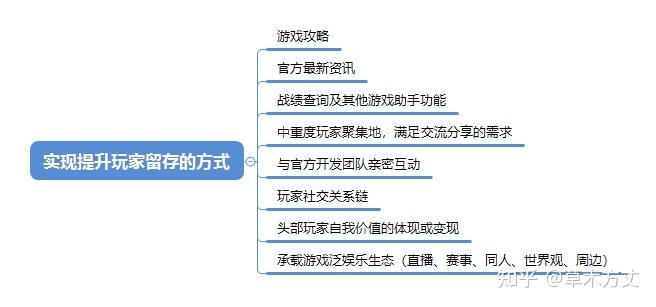

论证2：同行观点引用层

+ _2013年在上海举办的第十一届中国国际数码互动娱乐产业高峰论坛，暴雪副总裁Michael Ryder说过：_

_<u>“社区的发展一直是暴雪取得成功的关键。社区就像一个灯塔，或者说一个指南针，为我们提供未来前进的方向。”</u>_

  

+ _在2018年世界开发者大会上。Nico Nottin谈到《僵尸炮艇：生存》（Zombie Gunship Survival)60%-80%的月收入来自活跃的社区成员。_

  

+ _游道易在中国运营《变形金刚：地球战争》时，发行团队发现游戏75%的付费玩家都是活跃的社区成员。_

  

游戏社区之所以能成为所谓游戏开发团队的灯塔，是因为游戏开发本身是为了给玩家创造乐趣，而建立一个良好的社区互动氛围，才能从玩家侧获得真实有效的反馈，以帮助游戏本身在前进过程中不断校正方向，实现真正的调优，而不是负向更新。

同时，游戏中的高活跃玩家、高付费玩家相较于其余玩家，他们的分享欲、展示欲、炫耀欲更强烈，为了能帮游戏留住这帮核心玩家，我们也需要去搭建一个这样的平台帮助他满足他的需求。这也属于游戏精细化运营工作中的一部分。

  

论证3：数据层

这里的数据仅以我曾负责过的一个项目为例，不具代表性，不同项目不同生命周期数据都不一样

+ 数据之活跃数据：

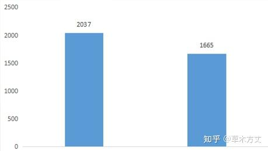

某赛季社区活跃玩家与游戏活跃玩家平均rank分对比

上图分高的为社区活跃玩家，分低的为游戏活跃玩家（从以前的总结文件中截的图，懒得在图上做备注了），想表达的是社区活跃玩家会相对更硬核一些。

  

+ 数据之付费情况：

当时这个项目整体付费率在1%-5%不等（非卖数值类），但同时在社区活跃的玩家里，付费玩家占比为47.5%，想表达的是社区活跃的玩家中不仅更硬核，也多为愿意付费的玩家。

通过拉数据看，那会儿在社区活跃的玩家中，历史总付费最高的玩家充了$5468，这个数据在当时那个产品里是很夸张的数据了。

  

+ 数据之回流层：

某个阶段，N赛季在社区及游戏活跃的玩家中，有39%的玩家在N+1赛季中期都还没有打过一场排位但他们仍然在社区活跃。这个数据一个是体现了产品在那个阶段的流失情况比较严重，其次是表达产品本身想要做回流的时候，社区这块是一个可以非常精准触达目标人群的平台。

  

### 2.3 游戏社区存在的主要形式与优缺点对比
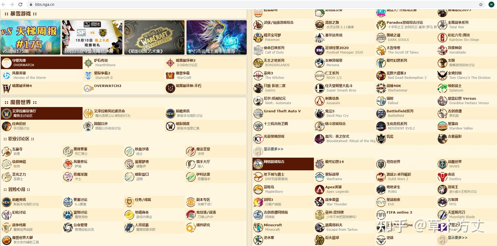

bbs论坛

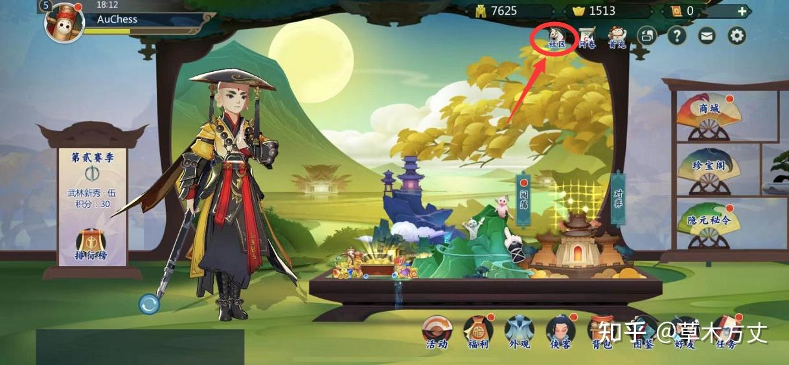

社区SDK或H5形式

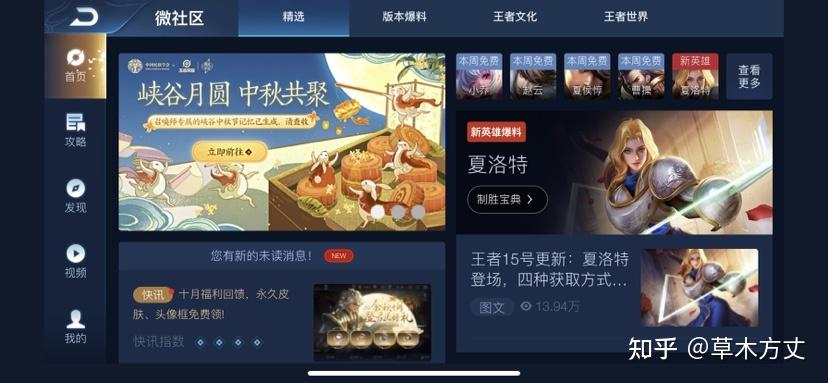

社区SDK或H5形式

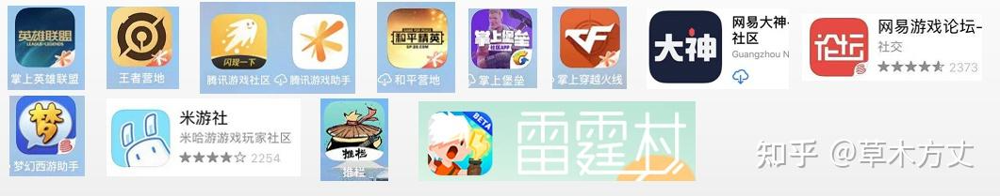

移动端APP

  

+ 不同形式游戏社区的优缺点对比

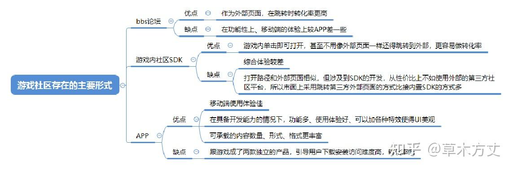

  

### 2.4 游戏社区自身的迭代
+ 前面提到的部分其实就是属于游戏社区产品形态的一个迭代趋势：PC端网页 → 移动端APP （部分小程序）。在这方面，雷霆游戏做的雷霆村APP也有一些尝试性的突破，即让游戏社区不仅仅只是一个常规的社区，而是让游戏社区更游戏化，有趣化。

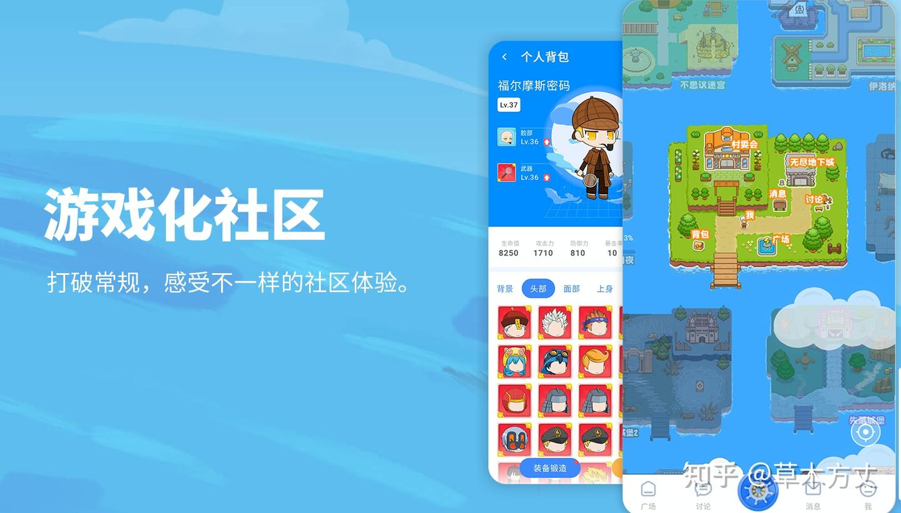

社区用户成长体系中的小游戏形式包装

除此之外，还有社区内容的演变：

+ 内容格式：图文 → 图文+长视频+**短视频**
+ 内容来源：小编采集素材整理文章+玩家发表动态 → 官方生产专业内容+通过活动搭建完整的KOL作者团队+直播/主播素材+普通玩家自发投稿内容+接入其他自媒体平台号的内容
+ 内容分发：依照时间/热度人工干预排序 → 个性化算法推荐

①.基于算法推荐的技术创新，内容资讯迎来了从一个随时间更新的内容页到精准推荐的信息流的转变

②.首页信息流：让信息更清晰、简洁、识别性更高，帮助用户缩短从选到决策的时间，以提高浏览效率，对内容运营能力提出了更高的要求

+ 内容变现：

①.参照各大自媒体平台的“创作者扶持计划”，让作者能通过内容实现流量变现

②.付费问题+付费课程

  

### 2.5 玩家对社区功能及内容的关注偏好
尽管现如今的游戏社区产品功能形形色色，但玩家使用游戏社区产品的时候还是有一些最核心的诉求是共通的，通过过往的工作总结了一些规律，但由于产品影响力有限，论据支撑力还不够，所以这里引用一下大产品的结论。

+ 其他产品结论引用：

下图是掌盟产品初期四个主tab用户的使用情况，资讯与战绩的使用占比达到了90%，70%以上的用户在看资讯。

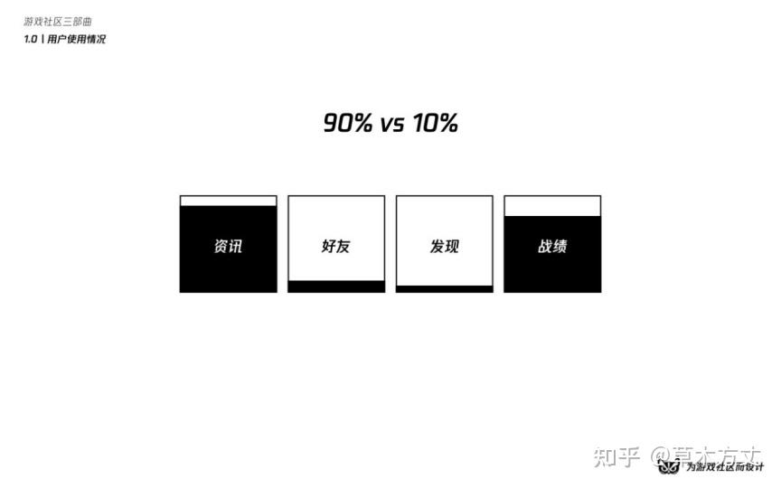

来源于参考文章，文末附引用出处

+ 个人经历总结：

我个人之前在做我们游戏的一款类似掌盟的产品，在很早期大概0.3.0左右的版本，版本完成度低，功能极度匮乏，使用体验极差，但是由于那个版本已经有了战绩查看功能并且数据已经通了，所以我们在推那个版本的时候，基本上可以理解为整个APP就主要是查看战绩和少部分资讯，其余功能基本没有，在这种情况下，当时也一度能在有活动的情况下顶到10万DAU，这是一个让我一直很印象深刻的数据。

在游戏社区内容相关的偏好数据方面，游戏攻略+官方公告+版本相关的资讯=80%左右的阅读量占比（福利活动除外，数据层面上是bug级存在），其他泛娱乐内容：世界观+主播+赛事+同人+社交+其他七七八八的内容=20%。

  

### 2.6 运营的好的社区是什么样的？
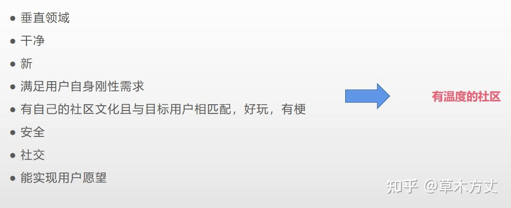

优秀社区的几个核心要素

先说结论，一个优秀的社区最直观的体现不是数据，而是当用户进去体验以后的那种感受。我更愿意用是否有让人感觉有温度来作为评判一个社区好坏的标准。

这个有温度的大概含义为：

+ 我进这个社区以后看到的内容领域是和我预想一致的，而不是一些稀奇古怪的东西（垂直）
+ UI舒服、配色舒服、排版舒服，没有广告或广告展示不恶心，没有无端的谩骂或脏话（干净）
+ 资讯相关的内容要是最新的，更新频次越高越好，而不是21年进来一眼看到18年更新的内容（新）
+ 我能看到我想看的东西甚至没预想到且喜欢的东西，或者通过某个功能做到我想做的事（满足刚性需求）
+ 有自己的社区文化或者梗，不管是“插眼”还是“mark”还是“开会”（好玩有梗）
+ 不要有涉及敏感的内容（安全性）
+ 能产生社交行为，无论是去关注追随大神玩家还是炫战绩炫资产吸引粉丝关注（社交）
+ 惊喜的发现在这里能和我见不到的明星、球星、榜一大神玩家产生互动，或者博人品抽豪奖（实现用户愿望）

要想达到以上描述的这种程度，需要做很多的运营工作。但当达到这种状态以后，新进来的用户是能感受到这个社区的温度的，这是一种神奇的感觉，这种感觉会驱使他再次访问你的社区，高频访问你的社区，然后你会慢慢发现你的产品数据在变得越来越好。

  

让人感觉“冰冷”的社区案例：

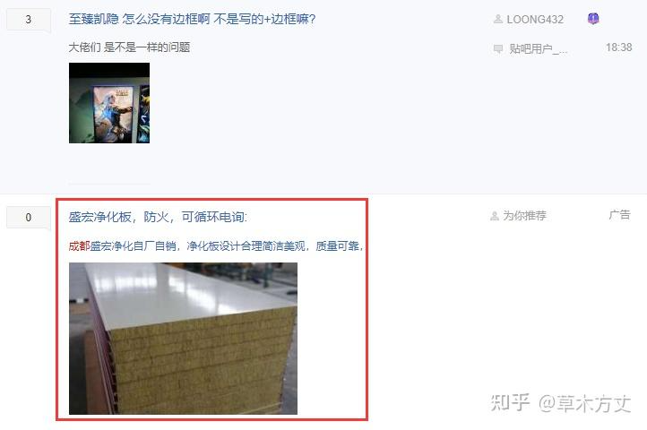

英雄联盟贴吧

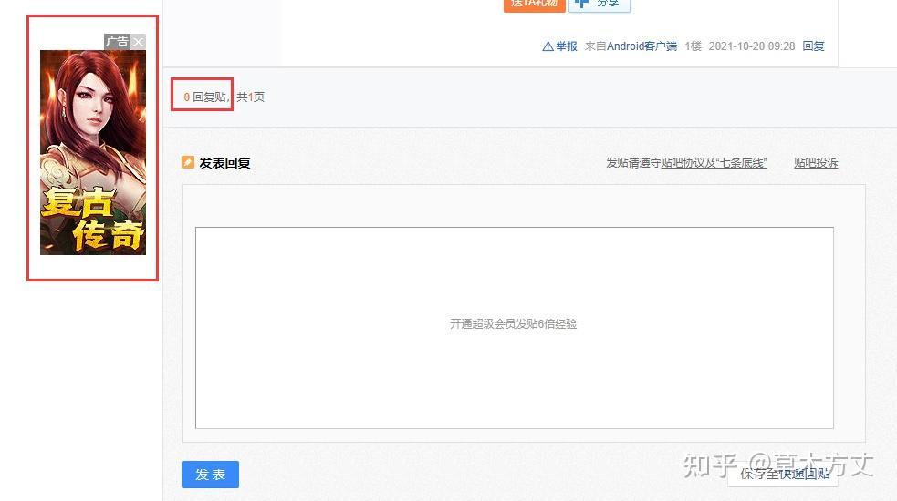

牛皮糖式广告和诸多无人互动的帖子

以上只是简单举例表达一下让人感觉“有温度”和“冰冷”的区别，有人在精心运营维护的社区和无人运营或运营的不好的社区，感受是非常明显的，这种差异会对来访用户造成不一样的感受，同时也必然会在运营数据上有直观的体现。

现在的贴吧一直是我在吐槽劣质社区时的典型案例，但作为优秀的游戏社区运营案例，我个人比较推荐<u>掌上英雄联盟</u>和<u>王者营地</u>两款APP，这两个产品都是作为同行可以参考的作品。（虽然团队投入资源不可相提并论）

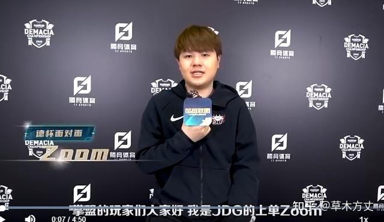

LOL官方给到掌盟产品的推广资源

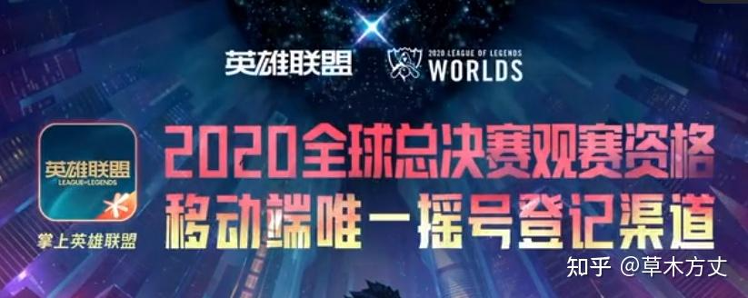

LOL官方给到掌盟产品的推广资源

从产品功能层面来看，一个成熟的游戏社区产品需要承载的新功能大致包含如下：

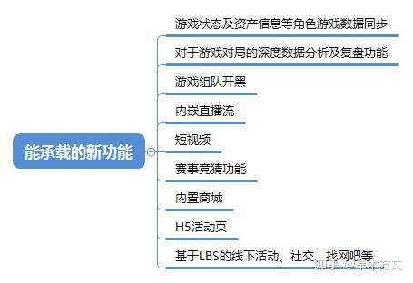

  

### 2.7 理想化形态：游戏客户端之外皆属社区
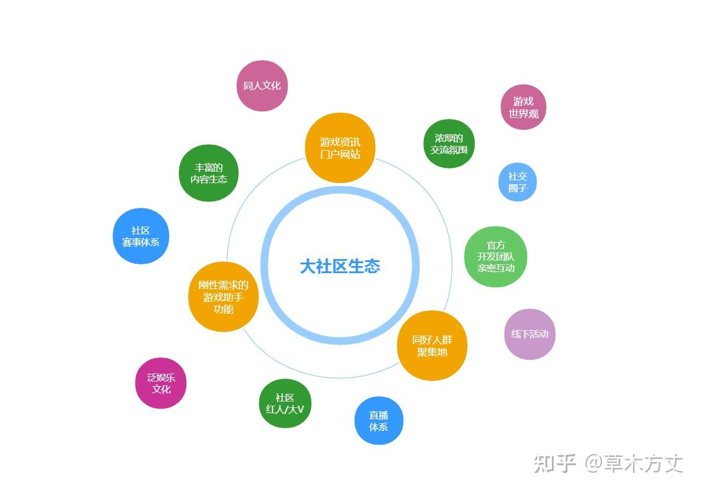

游戏社区的成熟生态

上图是我根据个人理解梳理的一个理想状态下的社区生态。期望的效果是即使玩家在离开了游戏客户端外，仍然可以处在一个这个游戏IP的文化氛围里。

拿英雄联盟举例，在你打完游戏以后，你可以在不仅限于掌盟的各大资讯平台浏览相关资讯，你可以在多个社区平台和其他玩家讨论六神装蛮王和六神装剑圣单挑谁更厉害，你可以在掌盟APP看你的游戏对局数据分析，晚上可以在被窝里看游戏直播，卢本伟PDD肉蛋葱鸡是大家茶余饭后的笑点，一年一度的S系列下饭大赛，走入各大高校的高校联赛，网吧会员特权活动……

上图中所描绘的理想画面，在英雄联盟这个游戏IP上都能找到真实的案例。**这就是一个理想的游戏社区生态，它不仅仅只是一个Q群或者一个论坛，而是遍布你生活中的许多角落，它的游戏社区氛围就是你日常生活的一部分。**

  

## 三、游戏社区舆情监控与报告
这部分内容相对特别一点，本来想放在日常工作实操部分去分享，但思来想去还是觉得这是对于做游戏社区来说很重要的一部分，足够从日常工作中单拎出来拿一段去讲。

### 3.1 关于游戏社区舆情
前面有论证到， 习惯访问游戏社区的玩家大多为游戏的高活玩家或高付费玩家，对于游戏开发团队来说，社区是一个非常便捷且近距离接触玩家的平台。通过这个平台，开发团队可以获得玩家对于游戏调整最直接、纯粹、真实、不留情面的“反馈”，这些“反馈”包含赞许、认同、建议和对开发团队亲人的问候。

当一个游戏项目的玩家受众还不多时，也许游戏本身的改动也不会太多，玩家的反馈量可能也就一天新增发帖几条，当处于这种量级时，确实不是非常需要专业的舆情分析，因为只需要扫一眼便知大概。但当一个项目体量比较大，玩家量级也比较高甚至于是全球多地区运营的情况下，开发团队对游戏做了一些调整后，全球玩家的看法与体验如何？这就需要用精细化运营的手段介入，通过运营侧去为开发团队提供专业的玩家舆情分析报告了。

  

### 3.2 舆情分析的理解与实操
我们在一个比较受关注的项目新上线阶段或某个特殊时期，大概会以“日报”的频率去向团队成员和老板汇报当下外网最新的反馈；当项目进入平稳期或非特殊阶段时，我们会以“周报”的频率去进行同步。一般来说，我们在每个大的新版本上线后两周左右，都会对这个新版本进行成效分析回顾，这个回顾内容中包含两部分，一部分是客观的版本成效数据分析，另一部分是主观的玩家反馈——即新版本专项舆情分析。通过主观+客观的全面分析报告，去真正的理解到这个新版本上线后的实际效果。因为在实际工作中，纯粹的数据分析报告偶尔仍会出现一些让我们无法理解的数据结论。此时，我们结合玩家的主观反馈，往往能找到最准确的解释。

过往我所经历的项目中，玩家量级虽然不低，但确实也没有达到市场最爆款的程度。常规非活动无推广微博博文或社区推文的回帖数大概是几百条至一千条左右。在这种量级下，我们去进行舆情分析的时候，还是更偏好于肉眼去看，虽然是有一些比较成熟的舆情分析工具：诸如企鹅风讯之类的，但在使用下来后，我个人感受觉得，工具固然是一个智能、高效、先进的工具，能帮助我们提升这方面的工作效率，这个无可非议。但是社区舆情是玩家的真实反馈，里面是包含了非常多的情绪，如何去理解和拆解这些情绪下面蕴含的夸奖、批评或者是阴阳怪气，目前这些舆情分析工具还没有一个具备基本网感的运营同学分析出来的结果准确。当然这些智能的分析工具我们还是需要在适当的时候辅以使用更佳。

  

### 3.3 不同人的分析报告天差地别
我在将社区舆情分析这份工作内容交付给一个新的运营同学前，习惯于优先强调清楚，这个分析报告的严肃性。

这个舆情分析报告是会直接向开发团队的同学甚至是老板传输外网玩家对游戏当前的评价，是会直接影响到开发团队对后续版本开发的决策方向，如果这个反馈不够精准有所偏差，那就会直接的影响到后续的版本规划，所以这一定不是一个可以儿戏的工作内容。

从我过往工作经历中看到过的出自不同人手上的舆情分析报告，感受真的天差地别。这个工作看起来好像很简单，只需要去浏览发帖或回复，汇总一下即可，实则不然。导致分析报告质量良莠不齐的原因主要有以下几点：

**①.****<u>最基本的报告版面排不好</u>**

因为玩家的舆情记录可能是文字，有的是图片，有的需要图文结合才能支撑结论，又是不同大小的图片又是不同长度的文字论点，不同重要程度的结论摘要的字体大小、配色，在邮件里排出来的视觉效果有的真的没法看，那报告的信息传达效率则无从谈起。

**②.****<u>对分析报告的基本认知就有问题，结论和论据杂乱无章</u>**

我个人认为比较好的论述顺序是：结论摘要清晰准确且分点论述，论述的顺序也是有讲究的，从重要性依次递减，每个分点论述的结论都单独用论据去支撑结论。

举例：

结论A（重要性10）

论据：****

结论B（重要性9）

论据：****

结论C（重要性8）

论据：****

结论D（重要性7）

论据：****

……依次往下

**③.****<u>分析报告的准确性要基于对游戏开发＆运营的基本认知</u>**

首先你不能连玩家在说什么都不知道，其次作为游戏开发运营团队中的一员，要有足够客观的认知去看待玩家的每一条反馈，哪些反馈是真实有效难得一见的有价值反馈，哪些反馈是尽管吐槽很多也可以忽视掉的反馈。

举一个极端的例子：很多玩家都反馈皮肤需要用钱买很不爽，这个点很多人反馈，看起来是需要非常重点去关注的问题，但实际上真的有价值吗？

所以我们要基于对游戏开发＆运营的基本认知，去找到真正很多人关注且有实际操作价值的反馈，去有效的同步给我们的开发团队。否则你的报告同步的内容，让开发团队的同学看到就只能很无语，没有任何专业度的体现。

**④.****<u>最终的结论要基于一个“度”的把控</u>**

除了以上举的极端反馈例子外，实际工作中还有很多很中性的反馈。就是会让你感觉好像这东西对也不对，可说可不说，有点价值但又不太好操作，拿捏不准玩家的反馈是否真的有效或者正确，在面对这种情况的时候，是没有一个标准的处理方式的，唯一的解决方案就是取决于负责这个舆情分析的同学对于“度”的把控能力。

这个“度”的把控能力的强弱取决于这个同学对于游戏开发＆运营行业的认知与经验积累，取决于对于这个项目的熟悉了解程度，取决于整个开发团队的做事风格，取决于PM的资源协调安排，取决于老板对于这个项目的重视程度。这项能力取决于很多因素，但综合下来，就是一个非常直观的能力差异体现，最终能在输出的舆情分析报告阅读体验上体现的淋漓尽致。

**⑤.****<u>舆情中应该要包含的内容</u>**

+ 会先按当前分析周期中游戏本身的重要事件，预先设定需要重点关注的方向，这些个方向将会是当期舆情内容的重点。（比如刚更新完/刚开新赛季/刚上新卡池/刚上新活动等等）
+ 除当下游戏本身的重要事件外，一些非意料中的玩家吐槽或者建议也是需要关注的重点。这些内容是不定期会出现的，比如一些开发团队未测试出的bug，游戏性的缺失，资源投放的前后矛盾，竞技平衡性的缺陷，对游戏玩法的一些建设性意见等等。
+ 近期行业内的一些变动或是竞品的上线，玩家对此的看法和口碑如何也是不定期出现的重点内容。
+ 当前游戏生态下的一些变化，例如头部玩家之间的纷争与人情世故、主播与主播间微妙的关系变化及其粉丝间可能的矛盾冲突、可能会有的水军恶意入侵玩家社区等。
+ 对于全球发行的产品，还需要额外关注每次更新可能因为文化差异对其他海外地区带来的一些矛盾冲突，主要是本地化这一块可能会存在的问题。

**⑥.****<u>如何去分析舆情</u>**

+ 针对上述提到的需要关注的点，去浏览不同的声音与看法，首先自己要对当前存在的各种观点有一个数。
+ 要基于自己对项目的理解、对当前玩家生态中KOL/头部玩家/大R/高活跃玩家/白嫖玩家/路人玩家的理解，去对这些观点做相应的权重划分，以推导出对于每个问题不同层级用户真正的想法，这样才有助于最后输出结论以及采纳结论。
+ 要基于自己对项目的理解，要根据玩家所描述的问题或建议，去推导出其真正的关键问题所在，因为有的时候玩家可能描述不清，或者说的不够完整。
+ 要基于自己对项目的理解，对舆情中分析出来的结论或问题进行重要级排序，要能够分清问题的轻重缓急，并能够在舆情分析报告中将需要强调的内容强调清楚，避免相关同学因未阅读到重点而忽视掉重要结论。

  

## 四、游戏社区运营的特性与难点
### 4.1 用户增长中无法突破的天花板
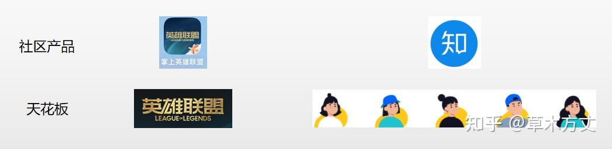

掌盟与知乎

这一部分主要是想通过“游戏类社区”与“应用类社区”进行对比，阐述这两类社区产品在运营工作中的特性与难点。

<u>①.“游戏类社区”相比“应用类社区”在冷启动时更容易。</u>

原因：“游戏类社区”可以理解为是依附在主产品游戏本身上的一款副产品，一般一款游戏社区（垂直类非类似小黑盒这样的平台类）在冷启动时，都已经形成了一大波这个游戏的玩家群体，所谓冷启动阶段，其实工作核心是通过活动或其他满足玩家刚性需求的功能去做好转化即可立即拥有一大批初期的种子用户。而“应用类社区”在初期冷启动时，才是真的冷。

<u>②.“游戏类社区”用户量级的天花板更死，“应用类社区”有更多可能性</u>

原因：基于前面提到的“游戏类社区”可以理解为是依附在主产品游戏本身上的一款副产品，**因此，游戏社区的用户量级一般来说是不可能超过游戏本身的用户量级的，这就是它无法突破的天花板。**而且从游戏用户转化到游戏社区用户中间还存在一个渗透率，这个渗透率决定了游戏社区用户量级想和游戏用户量级持平也是不可能的事情（后文会提到渗透率的常见数值）。相反，“应用类社区”尽管在冷启动期会更难，但它并没有一个死的天花板在那压着。**拿知乎举例，它的用户量级上限是地球上主要使用中文的且对生活有疑问想要找寻答案的这个人群量级。**显然，这个数据会大于绝大多数游戏产品的用户量级。因此，在不考虑用户增长工作成效的情况下，“应用类社区”用户量级的天花板比“游戏类社区”更高。

  

### 4.2 社区的命运取决于游戏的发展
上一小节讲到游戏社区总的用户量级不会超过甚至很难接近游戏本身的用户量级。除此之外，游戏社区本身的数据变化走势也非常依赖游戏的发展情况。

以下数据是过往业务中一个典型的案例，由于游戏本身的版本更新事故导致玩家大面积流失，对应游戏社区产品的数据也瞬间崩塌，一降不回。

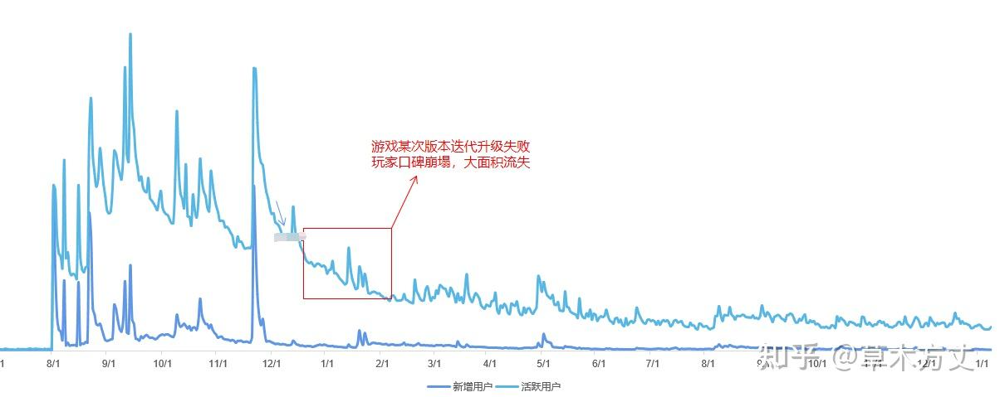

游戏社区APP的数据变化趋势

  

### 4.3 游戏社区渗透率常见的数值区间
先讲结论的定义，这里讨论的游戏社区主要是厂商自己做的或者就是垂直于某一个游戏的社区，而不是像小黑盒这样偏平台性质的社区。

渗透率=游戏社区活跃用户/游戏活跃用户

可以分不同时间维度去进行数据统计，例如天、周、月、历史总数据等。这里定义的社区活跃用户不是有效活跃，不需要用户进入社区后完成什么行为才算活跃，而是打开APP、点开网页即算当日活跃用户。

**基于以上定义的情况下，游戏社区常见的渗透率数值区间为：0%-10%。**

运营的一般甚至比较差的社区转化率大概：0%-1%左右

还比较不错的：1%-10%

优秀的游戏社区：10%及以上

_*以上数据是基于我自己的工作经验以及打听的其他游戏社区产品的数据结论，感兴趣的可以结合自己负责的产品数据对照看看，如果有异议欢迎交流。_

  

### 4.4 商业化的困境
游戏社区相较其他应用类社区的区别是，它更像是一个出生于“小康家庭”的孩子。不用像其他应用类社区一样有急于变现创收的商业化压力，因为它的诞生最核心的价值还是去服务游戏产品本身的玩家，只要做一个“乖乖听话的小孩”，帮助游戏做好玩家服务和留存，“家长”是不会太逼它出去挣钱的，因为游戏能挣钱，所以可以养着它。这个特性会决定团队在做游戏社区产品时，规划的重心和精力的投入都相对会把商业化部分排的靠后一些。

在其他应用类社区产品中常见的一些商业化变现手段，诸如会员体系、广告变现、直播、课程售卖、付费问答、周边售卖等等，在移植到游戏社区的过程中，都会有一定的“水土不服”。其核心原因是因为“游戏社区太过于垂直了”。基于某款游戏厂商的官方属性，让它不是很适合去接外部的广告来做开屏广告、贴片广告，这样对于玩家来说体验不好，很有可能因此导致玩家的负面舆情或流失，这就得不偿失了。能投的广告内容最好的还是游戏产品本身的活动信息、新版本宣传等等，但是这可没办法实现创收的目的，这样做的收益是需要将游戏和社区合并为一个整体去计算内部收益的。

会员体系这块是可行的一个方式，不过问题点是ARPPU不高且需要产品本身有一定成熟度，需要有足够的功能来衍生会员特权。

作为游戏社区产品来说，直播的成本太高收益太低，不是很可行。

游戏道具/周边售卖是比较常见的一种可行方式。

课程售卖、付费问答有看到一些产品在尝试，不过目前还没有看到做的特别好的，这个对于社区内容创作者的能力要求比较高。

因此总结起来造成游戏社区产品商业化方面困境的几个原因主要为：

①.本身商业化压力不大

②.过于垂直属性限制了一些流量变现的可能性

③.做付费点需要产品有一定成熟度，有足够的基础功能支持

④.用户基数和付费深度都是挑战

  

### 4.5 难以避免的内容水化问题
<u>对于社区类产品来说，有一个永恒存在的难题：“向前发展”就会“违背初心”。</u>

每一个被用心运营的社区，在早期都能被打造成一个“小而精而美”的产品，成为最早期那波用户的“乌托邦”。然而对于做产品的团队来说，向前发展、拥有更大体量的用户、做到更多的收入，是不可回避的一个课题，只是看早期想沉淀多久而已。

就社区类产品来说，一旦开始涌入新的用户，这群“外来者”就一定会某种程度上的破坏、扭曲、稀释掉原有的社区文化。这是一个不可避免的事情，在这个扩张期间，运营者会听到无数来自早期用户的吐槽：“你们是不是变了？”“你们还记得你们的初心吗？”。所以社区运营者对于社区氛围和调性的把控能力将决定着这个社区会不会在扩张期间“暴毙而亡”。

**一些可以参考的把控方法：**

①.在产品最初期阶段，就一定要确定好社区的调性与氛围，贯穿始终。并据此建立《社区管理规章制度》。

②.无论是对于最早期的种子用户，还是扩张期间涌入的新用户，都要用强有力的手段去向他们灌输这个社区的价值观。（通过UI设计高优先级展示《社区管理规章制度》、新用户答题、福利活动传达、官方运营多次宣导等不同的形式去灌输观念）

③.建立鼓励和优先推荐优质内容的机制，建立对违规内容及低质内容的处罚机制并坚决执行，执行后进行公示。

④.内容审核方面机审+人审并行，做好机审的审核效果优化，对于人工审核部分，要提供足够详尽的审核标准并根据各式各样的违规案例随时优化审核标准。

⑤.建立完善的社区用户自发投诉举报机制，建设社区文化共创氛围，让每个用户都能参与到社区氛围的裁决中来，并对这群“仲裁官”们给予及时有效的反馈和奖励，切忌成为一个虚假功能。

以上是一些针对社区内容水化、社区氛围跑偏问题的标准处理手段，但其实在处理这个问题上还有一个非常核心的因素：**<u>运营者对于数据增长和氛围把控的取舍</u>**。

简单来说，就是在某个阶段，如果运营者过于追求和沉溺于数据增长带来的成绩，那他在社区内容把控上就一定会手软，因为这样能带来眼下及时有效且可观的数据增长，虽然长久来看这不是一件好事情。如果要坚守对社区内容的把控力度，也许没有办法通过当下的数据看见成效甚至还会掉数据，但这样做给社区带来的好处是可持续性的，只是需要时间去兑现。

运营者是否追求眼下的成绩，是否具备长远的眼光和耐心，是否具备对于社区氛围的理解将决定他在数据增长和氛围把控这个问题上的取舍，这个问题的取舍将决定社区未来的发展走向。

  

### 4.6 自我价值体现的困境
这一部分主要是想说游戏社区本身的很多工作成效与价值是无法量化的，所以对于很多不是很理解游戏社区的同行或者其他人来说，很容易产生一个误解即为：做游戏社区对于游戏运营没什么帮助。

这里分两点说：

_（游戏和社区本身是一个整体，下文只是就讨论这个价值体现的问题可能会拆开看，但这不代表说游戏和社区是需要这么去斤斤计较的两个陌生个体）_

①.拿前面聊的商业化困境部分来说，例如通过游戏社区的开屏广告或贴片广告进行的游戏活动宣传、新版本宣传，使得一些游戏玩家回到游戏进行了付费或者游戏已流失但还活跃在社区的玩家重新回流，这些都是游戏社区之于游戏本身的价值，但是这部分价值一般情况下是没有数据去直观体现的。而且这个广告位也许也有100RMB、1000RMB之类的广告价值，但是游戏本身是不会掏钱给游戏社区这边的，所以这里面的这部分价值体现也是会被忽略掉的。

②.就过往的案例来看，是有很多玩家处于已经不玩游戏了但还关注社区的状态，每当有什么大的版本节点或者社区讨论热火朝天的时候，的确会有不少玩家突然热血涌上来回流的，也是前面提到过的游戏社区用户中是做游戏玩家回流非常好的一个目标群体，然而在日常工作中这部分价值也是相对不怎么能通过数据直观体现出来的。

**<u>还是强调一点，上面提的例子，其实也能通过数据打点追踪去做验证的，</u>**只是很多时候我们不会投入资源在这块去挖掘数据验证这个结论或者说做社区运营的同学会忽略掉这部分，更多的精力还是放在推进业务本身上。**<u>聊这一点主要还是想表达如果真的遇到了类似的困扰，可以通过数据去验证结论并打破质疑。</u>**

综上所述，在日常工作中，游戏社区运营的价值主要还是体现在业务负责人对这一块的重视程度。

  

### 4.7 游戏社区的发展决定性因素
个人认为，1-7分的运营效果取决于运营人员或团队的能力，如果想达到8-10分的运营效果，这就取决于这个社区产品在运营过程中可调配到的资源。

以实际业务举例，有的项目可能是因为IP监修方的压力，有的是因为CP和发行的分离，导致想在游戏内放一个社区的入口都是很奢侈的事情。社区想做一些节点活动需要用到游戏内的道具奖励作为支持，也是很难申请或者额度很少的。有不少类似的例子，会使得运营者在运营这个游戏社区时心有余而力不足。

相反的一些例子，就像前文提到的掌盟，甚至可以作为2020年全球总决赛现场观赛资格抽奖移动端的唯一报名渠道，在每年S赛的采访环节还可以在麦上有广告，在解说台也可以有口播宣传这样的资源，真是一般产品运营团队无法想象的资源。

所以从运营效果上来看，1-7分看能力，8-10分看资源。

_（其实资源协调也是综合能力的一部分）_

  

## 五、做好社区运营的关键点
+ 社区的定位要明确：垂直领域、细分领域
+ 建立社区管理条例及规章制度，并对社区内用户持续性的输出认知
+ 塑造并维护自己的社区文化
+ 要找到或创造玩家使用这个产品的刚性需求，满足他们
+ 大多数社区运营的核心是内容运营
+ 核心外团是社区活跃的发动机，外团成员的活跃度与社区整体活跃度成正相关
+ <u>在资源贫瘠的情况下</u>，擅用画饼的手段（非长久可行）

  

## 六、游戏社区运营岗的能力要求
+ 产品运营
+ 用户运营
+ 内容运营
+ 活动运营
+ 数据运营
+ 游戏运营

这里只简述一下其实是对一个人综合能力的要求，下篇内容会围绕这几个模块单独去讲核心的部分和实操的经验。

  

## 七、未来的成长空间与发展路线
### 7.1 业务层面
在深入去做了游戏社区运营这块业务之后，第六章里讲到的6个模块的运营能力都会得到一定程度的锤炼。基于这些成长：

①.可以继续深耕游戏社区运营这方面，只是可能需要根据不同团队不同产品的生命周期去变换不同的工作机会

②.基于以上的几种能力，也可以离开游戏领域，去做其他应用类社区。诸如知乎、虎扑、小红书、抖音等

③.以上几种能力的任意之一，都可以衍生出来一个细分的工作方向，就已经不止是局限于社区类产品，一样适用于电商、直播、工具等其他类型的产品

  

### 7.2 思想层面
**<u>做社区本质上是：想办法让一群人聚在一起，玩得开心，各取所需。</u>**

这是我个人觉得通过做游戏社区运营这个岗位可以锻炼出来的一种能力，它已经不仅仅只是局限为工作上，而是可以融入到你的生活当中去，帮助你变成一个更好的人。至于这个能力在生活中如何运用，则因人而异。

  
  

**其他参考文章：**

[为游戏社区而设计——解析游戏社区三部曲 - 腾讯游戏学堂](https://gameinstitute.qq.com/knowledge/100061)

[如何从零建设一个有人又有聊的游戏社区？｜问爆游戏人 - GameRes游资网](https://www.gameres.com/887665.html)

