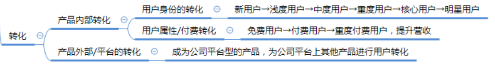

[下 | 游戏社区运营这点活儿，真就给他玩明白了？](https://zhuanlan.zhihu.com/p/426918851)

上文更偏理解层一点，本文偏实操的经验和核心工作内容的记录，会说的更简练一点。  
记录内容都是基于一款游戏社区APP产品的工作进行记录，其他非APP类的平台类社区工作内容也有相应可参考部分。  
文中抛出来的有些点，不见得会有标准答案，但都是运营过程中需要针对不同产品去思考的点。  
本文撰写于我已离开这个工作岗位较长时间后，所以一些结论、数据、理解都有不少遗憾和纰漏

  

## 一、产品定位
### 1.1 基本定位和运营目的
确定要做这样一款产品或运营一个社区时，首先要弄明白是搞来干嘛的。就产品垂直性而言我们是要垂直于什么样一个领域来做这样一款产品。当然绝大多数人对此还是不会有太多异议的，就我个人而言，**我们最初想要做这样一款产品的初衷是希望：****<u>服务于运营的这款游戏本身，为玩家提供游戏助手工具，承担玩家聚集交流的平台，相关游戏内容的沉淀平台，玩家意见反馈的收集。</u>**

这里还想再多提一嘴，现在很多体量大一点的游戏公司（尤其是自研自发或纯发行公司），都有想法说做一款自家旗下的游戏社区平台产品，集成公司旗下所有游戏，一来方便玩家管理，内部福利礼包资源打通，自建货币体系等。二来，对于自己后续想要推上线的产品，更容易在初期找到一批非常精准且忠实的目标群体。

所以**在做这样一款产品的初期，一定要想清楚之后是只单纯服务于某一款游戏，还是会发展为一款平台性质的产品。**例如到底要做的是“王者营地”还是“腾讯游戏助手”，这两者在初期的产品设计和运营上都有一些不同的思路，这也是我自己亲身经历的一个产品发展历程。

例如多游戏平台性质的产品，首页标签这里不同游戏的排序就有讲究（滑稽）：

首页标签的功能设计差异

运营层面，多游戏平台性质的产品，社区板块不同游戏的动态是否要混合在一起？还是分版块？都是需要思考的

  

### 1.2 社区文化和调性怎么定？
+ **内容安全**

往虚了说，每个人肯定都是希望打造一个好玩、有趣又实用的社区。但落到地上来说，一些很现实的标准：

+ 提到其他游戏允不允许？
+ 发Q群和微信二维码允不允许？
+ 脏话能不能说？什么定义为脏话？
+ 玩梗的边界在哪里？
+ 玩家间的撕逼理不理，怎么理？
+ 允不允许水贴，什么叫水贴？（发一连串的早安，晚安算不算水贴？删不删？）

以及其他一系列的问题怎么制定奖惩标准，官方是否介入，都会直接影响到你的社区文化呈现。

**<u>所以再重复提一次，在早期建立一份《社区管理规范条例》，并培养起所有社区用户能积极主动的，遵守和维护这份准则的社区氛围是非常重要的事情。</u>**

另一部分是关于社区内容审核的工作，除了首页的资讯内容外，社区动态版块中的内容以及资讯评论区内容大多数都为UGC，而UGC最大的问题就是内容的安全性和低质性。对于游戏社区运营来说，也一样需要引入内容审核的工作。

内容审核部分分两块，一部分机器审核，一部分人工审核，这里我是建议在条件允许的情况下，两者并行。**在绝大多数运营期间，采用“先发后审”的方式**，机器进行第一次过滤，如果没有问题则正常显示，人工审核在随后跟上，如果发现有机器审核遗漏的问题再特殊处理。**在一些如母亲生日之类的特殊时期，可以考虑设置为“先审后发”的方式**，需要机器+人工审核过后才能正常显示出来，以确保产品安全

这一块工作的难点主要为：  
①.如何制定内容审核标准及相关屏蔽词库的维护

②.如何向人工审核部门的同事进行标准宣讲

③.如何与人工审核部门的同事进行工作协同，这一块是重点。难度主要来自于绝大多数时候我们隶属于项目运营组，而审核同事大多来自客服部门，这是跨部门合作，在对方工作执行力、工作态度、责任心、质检等方面有很多需要关注和沟通的，而且沟通的时候方式方法很重要。

  

+ **社区文化**

咱这社区里，玩不玩梗？追不追热点？追什么样的热点？

社区里面的梗是要去硬偷其他社区的，还是咱社区结合自己的游戏特性去原创？

梗是由玩家自发去产生么？那多久才能出一个？要不要自己去带？怎么带？

怎么让新来的用户能快速熟悉咱社区的各种梗？是从产品层面去解决还是运营层面去解决？

以上都是针对社区文化这一块需要去思考的部分

综合以上，最终的社区文化不是由你口头上说是什么样就是什么样的，而是由你日常的工作所积累定型出来的。

  

## 二、版本管理
### 2.1 产品功能开发规划
无论是游戏运营还是游戏社区运营，在产品的迭代规划上，一定不能理解为只是策划或产品经理的事，运营一定要参与其中。（这一条理解会在之后就游戏运营的版本管理模块再细讲我的理解）

这一块首先要有项目的需求管理池，其中的需求应该分别来自于：

1.根据产品初期定位需要补足的功能

2.自我产品体验后的优化建议

3.竞品体验调研

4.用户需求调研

5.用户反馈的使用痛点优化

将通过以上几个途径思考出来的产品优化需求按照以下逻辑进行排期开发：

1.短期规划：当下紧急且重要的bug修复、能立即满足当前运营目的的需求

2.中长期规划：重要但不紧急的需求，开发评估实现有难度的需求

  

### 2.2 版本更新流程及更新方式
**更新流程：**主要想讲的是一定要标准化、流程化、责任到人。否则更新过程中各种小的细节项会导致错误频出。

**更新方式：**客户端版本兼容的情况下，一定要以兼容性更新为主；实在由于客户端代码改动过大，版本不兼容的情况下才选择强更。强更对用户流失影响很大。

  

### 2.3 其他小的工作项
**开发资源排期、版本测试：**这两块，大项目交由PM和测试同学去主要跟进，小项目就得运营自己多上点心，多主动推进一下。

**苹果商店、各大安卓应用市场提审和商店物料维护：**上手提几次包就熟悉了，重点是要细心别犯错。对于商店的各种物料要有一点敏感性。

**SEO：**学会根据自己产品特性和竞品的情况设置关键词和关键描述，在应用商店中做好标题和副标题的文案设计。其余的个人实践经验不多，这里就不多讲了。

  

## 三、用户运营
### 3.1 运营目的
运营的四个关键词：拉新、促活、留存、转化。

  

### 3.2 拉新
拉新也就是此前很火的一个岗位，叫做用户增长。这是很重要的一部分工作，无论是多实践还是看很火的《增长黑客》，说到底本质就是：**<u>找到一条或多条清晰的用户增长路径，通过数据，对这条路径上的各个环节进行转化效果分析并持续优化，以达到最终提高用户增长的目的。</u>**

对于所谓的用户增长路径，在其他应用类社区产品中，可能会很有多条，但落到游戏社区产品上，最核心的就是做好游戏玩家到社区的转化。包含但不仅限于在游戏内放置入口、争取游戏内多个资源位、配合游戏本身的一些分享功能、结合一些外部或线下活动的方式，并不断把这些路径上的转化效率优化到极致，那在这一块的用户增长上，效果就不会太差。

除了做好游戏内部生态的用户转化之外，社区产品在外部的发酵引流，也是一条可以尝试的路径。

再其次就是付费推广，这一条在游戏社区产品上应用的很少，ROI（投资回报率）太低。

总的来说，这一块最重要的就是**<u>思路+学会分析相关数据。</u>**

  

### 3.3 促活
要想用户活跃，一定要找对点，否则怎么做都做不活。点是什么呢？

+ 要切到用户的刚需：例如微信、抖音，你自己每天就会去打开，不需要谁催你。
+ 有他感兴趣的奖励牵引：很多人上拼多多、咸鱼，刷一些趣头条APP挣积分换现金之类的，劲儿一个比一个足。

基于游戏社区的一些促活思路

**插一个有趣的业内蹭热点案例：**

  

活跃相关的数据监控指标：

+ 产品日活数据
+ 不同页面、不同按钮的访问数（PV/UV）
+ 产品内内容消费数据（资讯的阅读/评论/点赞/转发）
+ 产品内用户互动数据（关注/取关/私信/点赞/拉黑）
+ 产品内低层级UGC产出数据（动态的发布量、评论量、点赞量、转发量）

  

### 3.4 留存
做留存和做活跃一样，**一定要搞明白用户为什么要重复、多次的访问你的社区**。无论是能满足他的什么痛点，还是包装活动、用户成长体系等奖励刺激，总之，找到一个有用的点，并不断优化击穿它，留存的目的就能达到了。

  

### 3.5 转化
在运营工作中，我们要做的转化主要分两块：

①.付费转化：即让免费用户成为付费用户

②.品牌转化：即付不付费没关系，只要用户能通过某款产品成为某个品牌的粉丝就行，收益嘛？来日方长。

  

而落地在我们运营一款社区产品的时候，转化主要是指：

相比前面提到的两个转化外，多了一层用户身份的转化，即通过运营手段一步一步的让一个新用户成长到他应该所处的用户层级中去。具体的思路会在后面的用户分层中提到。

  

### 3.6 运营手段
用户运营中较常用到的运营手段主要有：**<u>用户成长体系的搭建</u>**、**<u>用户分层</u>**、**<u>用户画像的绘制</u>**、**<u>核心用户管理机制</u>**、**<u>用户包装</u>**、**<u>KOL或KOC等明星用户的挖掘和管理</u>****、****<u>用户研究</u>**

  

### 3.7 用户成长体系的搭建
在一个社区或其他APP的生态当中，**要想做好用户活跃，搭建一套完善的用户成长体系是非常重要的事情。**（即常见的任务、积分、等级、奖励兑换）

关于用户成长体系，这里简单总结为：<u>将运营者希望用户去做的事情，拆分成一个又一个的小任务，通过设置一定的奖励，吸引用户一步一步的去做我们希望他做的事，然后让他得到反馈。</u>

其中的重点为：

+ 任务的设置（方向、数量、难度）
+ 等级数值的设计：根据我们对于用户成长周期的规划，去制定达到不同等级的时间节点。根据不同的时间节点去制定不同阶段的成长节奏，大的原则是要前期成长反馈强烈且迅速，中期平滑，后期放缓。具体的升级所需经验数值制定需要根据成长节奏和拆到单个任务的经验数值产出，单个任务的经验数值产出可以多参考同类产品，不宜用太小的数值，如1、2、3，也不宜太大，如50、500、1000等，常见的多为5/10/20。
+ 成长体系的包装：比如积分不叫积分而叫贝壳，LV1叫做“江湖小虾”之类的，包装形式也很重要
+ 成长的反馈：特权or实际能兑换到的虚拟奖励或实物奖励
+ 关注实际效果是否复合设计期望

  

### 3.8 用户分层是一种思想
如本章节标题一样，用户分层我不认为是一种运营方法，而是一种思想和认知。本质上是你要意识到，**<u>人是分三六九等的</u>**。只是看这个划分是依据什么样的标准来处理。

①.要意识到无论再大的用户体量，里面一定有一部分人怎么都只会是白嫖玩家，有的人怎么都只会充6元钱，有的人就是会大量氪金，有的人就是喜欢研究游戏细节成为大神然后享受被追随的感觉。

②.如何制定分层标准，或者是通过什么样的数据去定义用户分层，这也是非常关键的一环。

③.让每个层级的用户回归到他本应在的层级，然后再努力将一些用户往更下一层级进行尝试性的转化。

④.因为不同层级的人追求不同，所以在制定一些运营活动或其他运营手段时，一定要考虑到分层这一点，针对不同层级的用户都分别制定相应的运营手段。

⑤.在数据后台也可以按梳理的分层标准，对不同群体的用户进行标注分组，在进行某些运营手段后，也可以通过不同群组去查看此次运营手段在不同层级的表现效果。

从活跃角度对用户进行分层

  

### 3.9 用户画像的绘制
用户画像的主要目的就是帮助我们在产品运营各个阶段（尤其是在产品上线初期），认识我们的用户都是什么样的人，才好“因材施教”。其次也是用户分层中要参考的依据之一。

在用户画像的结论这一块，有一个比较经验性的结论：**“切忌做一次用户画像调研就一直使用这版结论，不同产品的用户群体很有可能会随时间变化而变化，对于用户画像的调研应该是一个动态持续的过程，因为人是会变得。”**

做用户画像调研的方式主要分两种：

①.问卷调研（适用于运营工具不发达，产品上线前未收集到用户行为数据时）

②.用户行为及状态数据分析（适用于运营工具强大，产品进入成熟期的团队）

问卷调研更主观，能收集到很多数据分析不出来的主观意愿，但主观意愿不一定代表用户真实的心声。

数据分析更客观，能分析出很多调研不出来的客观结论，更符合用户真实的行为习惯，但缺点是数据可能也会创造出一些让人困惑的结论，需要主观反馈才能推出因果。

综合而言，两者并用最佳。

<u>tips：在做问卷调研的时候，注意控制问卷的题目数量不宜过多；另外涉及一些偏隐私性的问题，诸如性别、年龄、职业、收入、消费习惯等建议放在最后而不是开篇就问。</u>

  

### 3.10 核心用户管理机制
核心用户在游戏社区运营中多为玩家外团，在其他应用社区中主要是一些大V或者KOL。

**一个社区的活跃与否，与核心用户群体的活跃息息相关，这一小搓核心用户群体是整个社区的活跃发动机。**

在搭建自己的核心用户团队时，要先想清楚，想找一群什么样的人。以游戏社区运营为例，我个人更习惯于找大学生这样的群里去做外团，优点是有一定的心智成熟、沟通能力，有较充足的空余时间可以配合我们去做一些事情，且大多数愿意“为爱发电”。相反年龄再小一些的中学生不太好沟通管理，而年龄再大一些的用户主观意愿更强，希望索取的更多较难满足。

其他的一些关键因素：

①.在招募候选人的时候，一定要有“面试”或“笔试”，以确保我们找到的是对的人

②.想清楚需要他们配合做些什么事，如何量化他们的产出

③.如果有人有热情想做但不会做，如何制作教程教会他们

④.如何制定奖励标准

⑤.保证奖励的及时发放，着重关注他们的正向反馈

⑥.大多数时候奖励都不会太丰厚，如何保证他们的“工作稳定性”

⑦.有人的地方就有江湖，这个核心用户团队的小圈子里，难免会发生一些冲突或妒忌，如何维护他们的人际关系，避免团队内部的敌对情绪和内讧也是要着重关注的一个点。

举一个在工作中见到的维护核心用户团队上很反面的例子：

一般我们在对外团玩家的管理沟通上，都会通过一个小的内部Q群去做，但是负责运营的同学却很不重视这个Q群的日常维护，一个月半个月不去说一句话互动一下，这种情况下，你需要外团协助你去做什么的时候别人怎么会帮你去做？你的外团怎么会活跃？

  

### 3.11 用户包装
在前面用户分层中提到用户是分不同群体的，在一个金字塔结构的群体中，始终会有一群人会是属于顶端的那一部分，他们会在人群中起到领导作用。就像现实生活中一样，绝大多数普通人都会有一个想要去追逐的“偶像”，可能是科比布莱恩特，可能是迈克尔杰克逊，可能是UZI，可能是周杰伦，总之正是因为这个真理，各行各业才会有所谓的“造神”运动。  
而这部分人，有的是通过优胜劣汰自然产生的，而有一些则是可以通过我们运营手段去“包装”出来的。在将他们的形象树立起来后并加以合理的管理，那么是非常有利于我们去运营整个社区以及把控舆论走向的。

以常规游戏社区为例所进行的用户包装塑造

  

### 3.12 明星用户的挖掘和管理
在做用户运营的时候，我最想强调的一点就是“主动，主动，再主动。”

对于KOL、KOC之类的明星用户运营上，一定要主动出击。主动投放相应的招募活动并给与来报名的用户积极回应。同时除了坐在工位上等，还可以主动去挖掘，比如做游戏社区运营时，你会发现在其他一些类似B站、抖音、taptap的地方，有很多非常优质、有潜力塑造为明星用户的玩家，在你没看到的地方输出优质内容，塑造他个人的影响力，但如果你不主动去寻找挖掘，很有可能他永远都不会加入到你的社区中来。

案例1：某个阶段我正在发愁我的社区缺少优质内容创作者，缺少优质攻略内容，然后某个夜晚我无聊刷B站的时候，搜了一下我们游戏关键词，发现了近期有几个我没见过的UP主在自发更新我们游戏的视频内容，而且质量都很高，瞬间看的我兴奋起来，赶紧联系了对方。之后其中好几个人就成为了我所运营的社区中优质内容贡献历史榜单的前列。

案例2：我带的一个运营同学，交待了他去运营一个高活跃的玩家外团起来。很长时间过去了，我去询问进度，得到的答案是还没进展，因为没有玩家来找他。（瞬间脑溢血）

  

不管通过什么样的方式，如果能挖掘到一些现成的明星用户进入你所运营的社区，在他刚来的时候一定要做好入驻活动，这对他以及整个社区都会带来非常积极活跃的影响。具体参考诸如斗鱼、虎牙、虎扑、微博、抖音之类的明星入驻的活动。

除了去外部挖掘之外，也一定要做好现有用户群体中的潜力用户培养，尤其是具备以下特征之一：高活跃、热心、有点游戏理解爱分享、喜欢做直播或者录屏、人缘好、女性玩家。然后给他们制定一些教程分享，开导开导，给予一定的资源扶持，也是很有可能去塑造出明星用户的方式。

**<u>这部分最重要的内容：明星用户的运营上要做好去中心化。</u>**

简而言之，在你倾注心血和资源去扶持后，一定要避免出现“唯一的神”或受关注度明显远超其他所有明星用户的现象。因为一旦这个明星用户出现“跳反现象”，将会对你的运营工作带来致命性的打击。即使他不跳反，也会变得非常有议价权，导致你在和他谈判的时候陷入异常被动的态势。

案例1：某直播平台倾尽资源塑造一个明星主播，成为直播界的顶流。而在此之后他们在和这个主播谈直播合同的时候，会变得很被动。同时，这个主播如果主动选择更换一个直播平台，会对原来扶持他的直播平台流量带来灾难式的抢劫。

案例2：某在线教育的社群中扶持了一个非常突出的意见领袖。但是某一天这个意见领袖选择了去别的平台买课，整个社群中多数学员都不讲道理的跟着这个意见领袖一起去了对面的平台买课。

以上两个案例，对于运营者来说都是很难接受的结果。所以在做明星用户运营的日常工作中，去中心化的思想就要贯穿始终。对于所有明星用户的影响力把控、资源倾斜程度一定要有分寸，保证一个良性的竞争生态，避免被一锅端掉，前功尽弃。

  

### 3.13 用户研究
[聚用户之力，做更好游戏 - 腾讯游戏学堂gameinstitute.qq.com/course/detail/10056](https://link.zhihu.com/?target=https%3A//gameinstitute.qq.com/course/detail/10056)

用研这部分就分享我曾看到过的一篇文章，内容不算短，但是对于理解用研这件事还是很到位的。

对于文章内容，简单总结为以下几点：

  

**①.用研贯穿单产品的完整生命周期，重点解决每阶段核心问题**

概念期：以一些行业、品类、竞品的基础研究信息支持产品

有明确的玩法概念：进行概念测试

初始版本期：确定美术风格和核心玩法

封测阶段：结合留存的数据表现对目标用户进行验证、找到流失原因

推广运营期：重点模块拆解，精细化研究支持

  

**②.用研对单产品多维度问题提供全景式研究支撑**

产品方面：对核心玩法、体验设计、周边系统的用户需求与体验问题进行观察

市场推广：市场分析、市场定位、营销策略、营销创意、营销渠道

运营：版本内容、运营活动、商业化、游戏外运营如赛事等

  

**③.研究的重点是要形成一个闭环：只研究不落实有效结论就无效，落实则需要产品团队配合**

**④.掌握用户行为模式，解决体验设计共性问题，将评估问题变成规避问题**

**⑤.用研协助产品运营诊断“病症”**

**⑥.从点到面研究分析竞品及整体市场**

除了针对单产品的问题进行研究，还需要对产品的竞品进行关注和研究，对一些细分市场进行分析，研究行业的发展趋势，甚至玩家在娱乐上面投入的时间、分布是怎样的，这可能都会影响到他在游戏之间的投入，所以也会研究玩家的娱乐趋势及文化信号。

  

**⑦.行业把握：对于整体市场需持续研究，了解发展趋势与变化**

这些输出有很重要的价值，主要是三个层面：

战略决策层：通过行业用户规模趋势的掌握，判断未来市场发展空间有多大，新的蓝海市场机会在哪里？

品类布局层：了解游戏品类发展趋势是怎样？各品类竞品情况如何？各品类间用户区隔在哪里？

产品策略层：了解目标人群及对标竞品规模与人群。

  

**⑧.如何让用户研究更好帮到产品**

核心点是：产品人员要能够有更开放的态度，多加入研究的过程，研究的结论如果跟自己预判不一样的时候要客观的分析这个信息所反映的是不是真实，为什么跟我的分析不一致，而不是盲目否定和拒绝研究结果。（有工作经验的同学会更能理解到这个点的含义和重要性）

  

## 四、内容运营
### 4.1 内容运营中的常见术语
UGC（User Generated Content）：用户生产的内容，诸如发帖、评论等

PGC（Professional Generated Content）：多指专业机构生产的内容，比如媒体机构、工作室、各个行业有专业身份认证的大V等，有的时候也用来代表官方生产的内容

OGC（Official Generated Content）：官方生产内容，用的地方不多，我见很多腾讯系的员工经常用，和PGC在使用上有重叠

另外还有什么PUGC等，反正你就折中理解为两者都有就行。我个人认为不用太在意这些所谓的说法，只是个形式，有个大概了解即可。

  

### 4.2 游戏社区中常见内容分类

就这么个大概吧

  

### 4.3 社区内容运营闭环机制

3→4→1的环节容易被忽略

常见的内容运营工作者（不是指自己做自媒体号，而是搭建一个内容平台的运营者）经常忽略或者弱化掉的工作就是3→4→1的环节，最终的结果就是会体现为内容越做越少，作者越来越少。

  

### **4.4 内容生产**
**4.4.1 用户对内容的关注偏好分析**

本文（上）篇提到过，对于游戏社区，我自己的工作经验总结下来的结论是：

游戏攻略+官方公告+版本相关的资讯=80%

其他泛娱乐内容：世界观+主播+赛事+同人+社交+其他七七八八的内容=20%

当然这个结论不见得适用其他产品，<u>但是重要的是，要知道需要去分析玩家对内容的关注偏好，针对性的生产内容，并且真正的掌握分析方法。这样才能保证你去做任何一款产品的时候都能做到点子上。</u>

  

**4.4.2 社区主要内容来源**

  

**4.4.3 内容制作的能力与技巧**

①.排版

这点就不展开说了，一个是自己的审美，二一个是多看就行。但是排版好坏真的差挺多。

  

②.标题与文案

首先标题和文案的使用场景和频次都很多，而且非常重要。

举例：

A：12/31日停服更新公告

B：12月31日大版本更新：**摇身一变竟成版本之子

C：12月31日大版本更新：有史以来最大的平衡性改动

（虽然B C也一般，但是怎么的也比A好，很多人日常工作中都会按A写）

  

再随便分享几条此前看到觉得还挺有意思的一些小文案：

出来逛，迟早要买的 —— 淘宝

折学 —— 淘宝

心里的话，用影像说 —— 华为荣耀手机

一杯敬过去，一杯敬过不去 —— STANLEY（酒）

我怕每一次弯道加速，我更怕被人甩在身后，#怕就对了# —— KEEP

  

当然也有一些为了让标题有意思，但是引发争议的案例：

<u>我们都是有问题的人 —— 知乎</u>

我当时打开知乎APP看到这条文案的第一反应就是不好的，心里的感受是“你才有问题，你全家都有问题”。。。 虽然我明白在知乎这个APP上这个文案表达的是什么，但还是怪怪的。

---

话说回来，其次我个人一直觉得对标题和文案的这种嗅觉、撰写能力，沾点靠天赋，有的人就是能出东西，有的人怎么写都不对。我很抗拒去接受这种靠灵感的东西能够被死板的拆解为公式，模板化的去套公式。但我也不得不承认，好的文案看多了，的却也能从中发现一些规律。

  

分享一些记录的“公式”：

  

**文案的4个常见套路**

痛点型：恐惧性的问题描述+解决方案

权威型：知名品牌或吸睛头衔+分享内容

获得型：产品名+身体获得/心理获得/财富获得

速成型：耗费时间少/学习任务少+呈现效果

  

**6大要素**

喜好：禀赋效应，损失规避

权威：专业性，名校名企，大咖推荐

从众：利他心理，社会认同

承诺：求快心理，获得心理，行动效果

互惠：价格锚点，占便宜心理

稀缺：紧迫感，专属感

  

**驱动用户行动的关键点**

惧怕亏损与逃避心：惊喜优惠、限时限量、算账、价格锚点、认知对比、恐惧诉求等，源自人们天然的“损失规避心理”。

社交影响与关联性：别人的行动或想法会影响我们的行为。使用好友对话、有新闻感、畅销、顾客证言、权威专家都属于这里。

进度和成就感：获得“干货”“实用锦囊”、希望他人的承诺等，源自于人们对“成就”的内在动机。

缺性与渴望：是因为你想得到某样东西，而这样东西获得的难度很大且需要付出很多努力才有可能得到。饥饿营销为什么如此奏效？“干货”中总结的“紧迫感、专属感”就源自于此。

未知和好奇：写意外故事的标题源自于这里。

  

关于标题和文案就说这么多，提方法提的多一些，具体的案例提的少，可以再多找找，对爆款的标题和文案试着拆解一下原理。

  

③.常见的社区内容栏目

+ 下面提的都是栏目的本质，对于栏目名称的包装可以结合不同产品特性去包装

  

④.游戏社区运营中的内容运营涉及很多麻烦的素材采集

简单来说，因为官方需要给玩家提前展示一些新版本、新皮肤、新英雄、新场景等爆料内容，所以在制作这些爆料内容的时候需要去采集素材，采集素材的过程可能会涉及到去游戏开发引擎实录、装测试包用指令解锁一些功能开启条件或者解锁资源、找美术要一些原画文件之类的，可能其他行业内容运营不涉及的工作，看起来简单，实际上还是需要一些能力的，诸如：

跨部门、不熟悉的同事沟通能力

游戏开发工具、模拟器的使用能力

对一些美术原画、3D建模、视频后期处理的基本认知能力

对一些常见的录屏、截图工具的使用能力

  

**4.4.4 社区团队配合流程**

我从之前我经历的社区团队内容生产流程中，抽象出来一个简单的流程：

①.开选题会

②.负责人定最终的内容排期，并视情况分配给不同的人

③.各自进行内容生产（包含素材采编）

④.内容返给负责人监修，并反复修改

⑤.定终稿，交付团队其他同学进行多语言本地化

多语言文本配合在线文档

⑥.提交美术需求给美宣团队制图

美术需求与多语言文本在同一在线文档，方便多语言同学和美宣同学协同工作。

  

⑦.美宣返图，校验制图需求是否无误，**重点检查多语言文本的使用**

制图上需要重点检查多语言文本的使用是因为，例如英语、俄语、韩语等其他语种在制图排版的时候可能由于美宣同学不懂其他语言，导致换行错误让一个完整单词被分开、用错中英文标点符号、少一撇一捺意思都差很多等问题。

⑧.排期发布

  

**4.4.5 如何提升内容数量**

①.不断主动挖掘更多的内容作者

②.内容作者的培训（教会玩家如何生产内容，教会核心作者如何在平台创作规则下竞争）

③.加强内容作者的正向反馈

  

### 4.5 内容分发

在做内容分发的时候，产品是否具备功能支持对于内容阅读体验的影响非常重大。**这里想重点强调的是：内容更新的时效性。**

**资讯的时效性更多情况下是取决于内容运营者的工作习惯、态度和能力。**比如一篇内容制作、采编的速度是否逾期？是否因为自己的疏忽忘发漏发？

这也是作为内容运营者的一个烦恼之一，就是因为要追求时效性，所以很有可能会在你假期的时候、睡觉的时候、恋爱的时候、陪伴家人的时候临时紧急通知你，你需要撰写一篇内容，或者你需要紧急发布一篇内容。这个问题不是说你能力强提前规划好就能避免的，这是无法避免的。

（我以前负责管微信群的时候，放假期间随身带俩手机，随时准备发东西。负责游戏社区后因为可能会有紧急更新公告，度假期间随身携带电脑，这都是一些类似的案例）

  

**<u>在做APP产品的内容分发中，还有一项非常重要的工作就是：APP PUSH。</u>**

关于这部分的工作重点提几点：

①.APP PUSH对于资讯内容触达用户的帮助还是很大的，虽然很多用户会屏蔽通知，但这还是需要坚持去做的工作，对于提升内容阅读量、APP打开数、日活都非常有帮助。

②.在想做好之前，先学会怎么避免运营事故，推送的各种运营事故就不再赘述了。

③.学会通过推送不同类型的内容，通过做单一变量对照试验（控制时间、内容、长度等维度），获取不同的数据，对数据进行分析，研究出最好的推送方法。

④.我过去的实验积累告诉我APP PUSH打开率一般在0%-8%左右是比较正常的值，都比较低。

⑤.我们产品接的是友盟U-PUSH（[消息推送平台_U-Push-友盟+](https://link.zhihu.com/?target=https%3A//www.umeng.com/push)），还不错的工具，是聚合推送。

  

关于APP PUSH，分享一篇文章：

[友盟全域数据：想要提升App消息推送的打开率，先了解背后的原理吧！2 赞同 · 2 评论文章](https://zhuanlan.zhihu.com/p/109532990)

  

### 4.6 内容消费

内容消费阶段主要是用户在阅读我们生产的内容，在这个过程，我们重点要做的几点是：

①.优化用户阅读、交互体验

②.监控用户消费的进度与效果

③.确保我们找到了用户想要的消费点

④.想办法让他们帮忙传播下

  

### 4.7 内容反馈

在内容反馈环节，<u>我们工作的重点是要让内容创作者感受到他的付出带来了什么积极影响，他自己得到了什么收益，他能找到驱动力说为什么还要继续配合我们生产内容。</u>

这里还有一个小细节可以做好但我看到很多同学都忽略掉的点是：给作者的奖励以及名单要公示出来！这又不是很丢人的事，为什么都不喜欢公示呢，这明明很能满足人的虚荣心！这是多么好的运营资源呀！

  

### 4.8 内容质量＆安全性把控
这也是非常非常非常重要的一部分。

<u>内容质量：决定社区质量</u>

<u>内容安全性：决定社区的生死</u>（违法乱纪不符合社会主流思想的内容千万马虎不得）

具体内容审核相关的工作前文已提到就不再赘述，这里只强调重要性。

  

## 五、活动运营
这里只强调方法论，不列举具体案例。如果想抄现成的，那案例太多了，随便一搜都能找到很多不错的案例。

  

### 5.1 先确认活动目的
做活动前不要先想活动形式、奖励、包装效果，而是先想清楚目的是什么。做活动只是用来实现运营目的的一个运营手段，切忌本末倒置。包装的再好玩的活动，如果没有达到最初的目的，也是失败的活动。

对于运营来说，<u>做活动的目的常规也就</u>**<u>拉新、促活、留存、付费转化</u>**<u>。</u>

<u>偶尔一个活动能顺便满足2-3个甚至多个目的，但这只是顺便。切忌在活动一开始设定目的的时候，就希望夹杂多个目的，这样反而容易迷失。</u>

  

### 5.2 活动类型和包装
先确认好活动目的，至于包装形式肯定越好玩越有趣，效果也可能越好。但终究只是形式，目的是否达成才是最重要的。

市面上体验到的各种活动，回到本质上类型无非也就是：签到、话题、晒图、盖楼、辩论、分享、抽奖、竞猜、收集、兑换、拼图、完成指定任务、通行证等等。

结合活动目的、常见的活动类型本质，再加以主题、文案和美术效果的包装即可，当然这个环节也比较考验一个运营同学的天马行空、想象力、创意、平时的积累。

  

### **5.3 活动开发资源排期申请**
一般来说，很多大型、完整的活动都是需要额外的开发工作的。所以涉及到多人协同的工作，脑子里一定要有一个非常重的观念就是：**<u>“别人是否有排期配合你？”</u>**

所以在规划一个活动之前，要先基于自己的经验和对团队的了解，想清楚你有多少资源做活动，你想做的活动需要多少资源，来不来得及？

这项工作很影响最终活动是否能顺利落地，这项工作需要你对工作规划的提前量，以及跟PM或者产品经理沟通开发排期时的“人情世故”沟通能力。

  

### 5.4 活动节奏＆时间节点规划
①.想清楚自己想做什么活动，为什么做之后，一定要找到合适的时间节点，搞清楚前前后后的节日、版本节点，想方设法能结合时间节点把活动有个合理的包装

②.当然有的时候也是先找可以包装的时间节点后，再来想的活动目的和活动形式

③.活动排期的时候要考虑到用户体验的问题，控制一下节奏。比如你做拉收的活动，不能想着为了做收入一直拉一直拉一直拉，用户消费也是有个节奏的，买了的东西也要用完了再买新的对不对？用户在消费的时候是不是可以配套一些消费活动帮他消费的更开心更快，以便能尽快开下个拉收活动？活跃相关的活动也类似，别搞的用户心太累，或者钱包太累，走不长远的。

  

### **5.5 活动线上情况关注**
做活动的时候，一定要有个心理预期就是：“无论你测试的再充分，活动依然有可能在任何一个时间任何一个环节出现你想不到的bug，而bug会带来未知的影响”，所以在活动上线后一定要重点关注活动的情况，不要一放假一下班人就不见了，活动在线上出什么篓子都不知道。

有问题一定要第一时间通知相关同事配合一起处理。

**<u>线上出现的问题，一定不要觉得问题不大，在未通知任何负责人的情况下，擅自修改线上资源！！！</u>**

  

### 5.6 活动奖励申请发放
这一块主要想强调：活动奖励一定要在活动前确认好再做，不要活动先做了再来说奖励的事儿，万一你觉得百分百能申请下来的奖励出了点问题，你无法给用户交代。

其次，在活动前设计奖励的时候，一定要有个意识是不要给自己埋坑，因为活动结束后处理奖励的发放也都是你的工作，别做的时候爽嗨了，做完发奖的时候人傻了。

具体的案例比如：

①.涉及实物奖励的

②.涉及邮寄的邮寄地址、邮费相关

③.涉及个性化定制奖励的

④.涉及现金奖励的，尤其是跨境的国家外汇管控、汇率、税费等问题

⑤.涉及大量奖励数值设计的

⑥.涉及合同以及法务流程的

⑦.奖励发放时间别说太死

……

诸如以上的问题，每个处理起来都够呛人的。

  

### 5.7 活动复盘
针对复盘这件事，会再专门找时间总结复盘工作的方法论。这里只是想重点强调，做完活动一定要复盘，我见到很多人的工作思维定式里是没有这个环节的，做完了就做完了。

做活动复盘是必要且必须的一件事，它的目的主要包含：

①.给为你提供资源（包含你的领导、合作部门）的人一个交代，以后才好继续合作

②.给事情一个总结，做的不好的地方下次才能优化掉，否则会一直做的不好

③.给自己一个交代，对于自己来说是一个能力提升的机会，同时方便以后的沉淀和回顾工作

总之，谁能养成复盘的习惯，谁就能感受到复盘带来的好处。

  

## 六、数据运营
### 6.1 理解数据运营
这是想单独写一篇的内容，在这里简单提一下：**<u>数据是帮助我们去分析事物客观发展变化规律的一个工具。</u>**

①.要培养起数据思维，用数据来说明和论证结论

②.做数据运营的时候，对于数据的收集整理一定要严谨，整理数据是一个细活儿

③.一切的数据分析都要基于数据是正确的情况下进行

④.理解数据分析出来的结论是客观的，但不见得一定符合事情本质，数据结论依然可能有误差

⑤..数据结论如果有误或不够精准，大多是人的问题

⑥.数据推断出来的结论如果无法理解，记得结合主观的反馈去思考

⑦.一定要带着质疑的眼光去做数据分析，因为即使你的工作无误，也有可能因为数据挖掘的同学、数据上报、数据平台的bug等各种原因导致数据有误，所以要具备通过经验去发现错误数据的能力

  

### 6.2 游戏社区运营常用的数据

  

### 6.3 数据运营的能力要求
①.最基础的是能力要求是学会最基本的数据收集、处理工具，诸如一些简单的excel功能、函数的使用，一些简单的可视化数据后台的操作，一些简单的sql语句查询使用等。因为做数据分析的第一步是，你要先能找到数据。

②.有的时候你是定向分析指定问题，针对这个问题要能去找到相关的数据分析出结论（问题已知，数据未知）。

③.有的时候是给到你一堆数据，去从这堆数据里找到有效的结论（数据已知，结论未知）。

④.数据分析还得基于对业务本身的理解来，脱离业务、不熟悉业务的情况下，分析出来的结论都是没有意义的。所以除了要具备基本的数据分析思维外， 还得真正的了解业务本身。

---

嗯…… 关于游戏社区运营的记录内容暂时就先写到这，因为在写这两篇内容的时候，其实我已经离开这个岗位有一段时间了。所以难免有些纰漏，以后想到再慢慢查漏补缺吧。虽然写下来有些遗憾，尤其是有的地方想再深度剖析一些更具体的日常案例，但碍于时间久远案例丢失以及当前时间精力有限，也仅仅是点到为止。也罢，遗憾是必然存在的，遗憾本身也是一种美。

后面还有别的专题内容要整理，就先溜了。

  

  
大多数人都是被别人影响，很少有人能真正的带给别人影响（积极正面的）。

