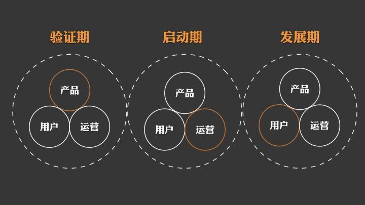

# 冷启动、热运营、自生长

### 冷启动
**[用户出于自发的了解到产品，并一定程度上进行传播与推广]**

 “冷启动”最早是指电脑的一种重启方式，但在互联网领域中，指的是初创企业的互联网产品如何获取第一批用户。在大部分的情况下，“冷启动”意味着在没钱、没人和没名气的情况下，怎么帮助一个产品获得第一批种子用户。

####  1. 什么样的用户才“配”做种子用户？

 种子用户其实谈的人很多了，但是我要说的是：不是所有人都配做种子用户，也不是第一批人就叫种子用户。

 一些讲座群，群主非常辛苦地请各种大伽来做讲座，讲座时效果不错，但是没有讲座时，这个群马上就半死不活了。为什么？群主百思不得其解啊。因为这个群没有“土生土长”属于自己的大咖！

 想一想，假如知乎只是请李开复、葛巾偶尔来做一次演讲，不只是大咖自己觉得与这个社群没关系，没有紧密的连接，社群用户也会觉得没有黏合力，社群没有吸引力，吸引他们的只是偶尔来做客的大咖而已。

 一个社群一定要有自己的大咖！大咖就要从种子用户中来——种子用户一定要具有某种特点，使他“配”成为这个社群的种子用户。他们要么具有吸纳新人的特质，要么就要具有维持老用户黏性的特质。

 这就要说到社群一定要有一定的复杂性了，虽说是具有某一共性的人聚集在一起成为社群，但是这种类同性在短暂的“哇靠终于找到同志了”的新鲜感和归属感过后，只会带来乏味。

 曾经有个关于同学群结构的笑话——1、要有一个傻不拉叽的群主。 2、要有几个风姿不减当年的万人迷。3、要有几名不甘老去的世俗愤青。4、要有几个三天两头晒养生的专家。5、要有几个有事没事经常对掐的好友。6、要有时不时蹦出几句冷幽默的疑似思想家。7、要有掌握各种小道消息的“内部”人士。8、要有几个爱发黄段子的奇才。9、要有几个经常值夜班和比公鸡起得还早的失眠者。10、要有几个存储记忆能力超强的超级大脑。11、最好还要有几个文人骚客。12，还要有几个视金钱如粪土，时不时发红包的爱心人士。13、要有一名正襟危坐经常维持群规的纪委书记。14、要有一位甘愿受虐经常挨骂被戏谑的好对象。15、要有一位经常请客，甘愿买单的隐形富豪。16、要有一位经常身在海外，心系本群的时差先生。17、还要有经常召集各种聚会的群众饭醉领袖。18最后也要有众多个一言不发，宁愿潜水憋死也绝不退群的基础群员。一共18类。

 说这段话的意思是：种子用户一定要精心筛选！请像综艺节目选不同定位角色一样去选取你的种子用户！一个社群里，一定要有能够承担不同任务的人，他们之间的冲突、张力、吸引、讨论等才会维持一个社群的基础活性。这就是用户结构的问题。

 在营销经典著作《卖轮子》里提到了几种关键的角色：比如缔结者——拥有超强的个人魅力，是梦想和未来的贩卖者，仅靠一两次接触就能成交；向导者——对技术十分了解，能够根据不同客户要求研发解决方案；关系建设者——善于靠日积月累的公关赢取客户信任，能够尽可能为客户利益着想；销售领袖——带领一众普通销售人员，用标准化的客户服务卖尽量多的产品。

 套用到社群里，起码要有牛逼的专业人士，他们可能古板严肃宅男属性但是专业知识很牛逼或者资源很雄厚；还要有擅于插科打诨链接各方关系的万金油，他们的人缘特好，能卖萌能卖腐，情商特别高；还要有一些比较能挑起话题点的话痨型人物、一些总是能拿到小道消息的灵通人士等等等。

 你如果仔细看综艺节目就会发现基本套路就是如此：一个比较博学比较话痨的灵魂主持人、一个常常犯二插科打诨的捧哏副手以及一个经常被黑出翔但还是蠢蠢惹人爱的萌货。这部分说太多了，过。

#### 2. 如何获得种子用户？

 种子用户这阶段肯定要靠人力，靠人去推。怎么找？

 一是靠人脉推荐；

 二是笨方法，根据你的社群的定位，去微博、知乎、豆瓣、天涯甚至草liu等社区去挖，挖那些满足你刚才制定的用户结构的人，挖活跃度高、产出也高的人，挖意见领袖。一对一的沟通效果更好，这阶段就别想省劲。

 至于人家为什么来你这儿？请看下一节。

#### 3. 如何建立维系种子用户的机制？

 万变不离其宗，马斯洛需求层次理论：生存、安全、归属、尊重和自我实现。这方面其实用句术语说叫“社群的核心价值”，翻译成人话就是：这个社群能够为用户带来哪些利益？这要是想不明白，社群也别整了，因为你都没想明白聚集起这帮人来干什么。

 还是解释一下吧，假如你是用户，你加入一个社群是为了什么？是获取知识？还是相亲约P？还是找工作？还是资源对接？其实一言以蔽之，互联网的最大优点就是降低寻找成本，寻找什么？忘了是58还是赶集网的广告词了，说得特明白：找工作找对象找房子找饭馆……甚至是找钱和找投资机会。

 那么有人问了：这些网站都做得那么全了，社群还能在这方面做出什么花样来？这位朋友我得说你很有思想，很擅于思考问题。对，社群与这类网站的区别是什么？社群是基于强关系的，具有更高的信任度。你是相信素未谋面的陌生人，还是更相信线上聊过线下见过的熟人？

 有点说跑了，话说回来。秋叶这个人总结过七个社群短命的原因，什么失焦、蒸发、无聊、无首、暴政、骚扰和陈旧，其实总结起来就是一个原因：没有持续为用户带来价值。

 总结一下就是二十个字：线上多沟通，线下多聚会，定期有话题，没事搞奖励（物质以及精神最好都有）。比如知乎建立的投票排序制度（事实上我觉得知乎就是一场政治实验），以及线下沙龙和聚会等。再比如正和岛搞的线上社区+线下私董会+岛邻大会等等。

 不多说了，但是一定要额外注意的一点：种子用户一定要有特权！这种特权或者表现在名称上，或者表现在某种产品的优先试用上。没人愿意轻易放弃到手的东西，哪怕这东西是虚拟的浮华的，这种特权可以维持种子用户的热度和黏性，也会激励后来用户维持活性，憋跟我说网络社群就是去中心化的，也憋跟我扯什么公平公正公开民主平等，这就是个阶级社会好伐~分不清“是然”和“应然”的都回去补课！

#### 知乎回答中总结的要点
+ **冷启动不是运营推广的初期阶段，而是整个项目从0到1的过程。**至少包括产品、用户、运营三个基本要素。很多人只注重运营，忽略了产品（MVP构建）和用户（种子用户获取和运营）。
+ **冷启动的重点是验证项目可行性，而不是量的突破。**就好像一颗种子长成参天大树，至少包括两个变化过程。一是从种子到小树苗的质变。一个是从小树苗变成大树的量变。前一个过程，从绝对量上来讲，不管是种子还是小树苗，其实都是很小的。但是，它的形态发生了巨大的变化。这个过程至关重要，土壤、水分、温度任何一个因素（当然，最重要的是种子本身）都可能导致彻底失败。冷启动其实是营造合适的内外在条件，让种子发芽变成小树苗的过程，而不是后来的从树苗到大树的过程。
+ **冷启动不是一次性的突破，而是一个分阶段的过程。**至少包含：验证期、启动期和发展期。很多人只盯住了启动期，而忽略了前面的模式验证和后面的可持续发展。

### 热运营
**[用户通过官方活动了解到产品，并为了某些****其他目的（创作、集赞、转发得奖品...）****一定程度上进行传播与推广]**

#### 1. 社群门槛
 一个社群一定是要有门槛的，门槛内是一种身份识别，没有门槛很快就不是社群了，会进来很多奇怪的人，比如专门贴小广告的，比如传销来发展下线的，憋小看这些人，绝对具有毁掉一锅汤的能力。社群有一定的门槛，比如爱好兴趣、比如邀请链、比如同一地域、比如回答问卷等，某种程度上会提升用户对社群的归属感甚至荣誉感。这方面也有很多例子，比如美国高校兄弟会等等，自己去查。

#### 2. 制度化
 有人的地方就有江湖，如何处理纠纷？要有一定的奖惩机制。社群里容易形成小圈子或者人情关系，在抹不开脸的时候制度是最好的法官。这个不展开谈了。

#### 3. 分类激活措施
 邮件营销是分类激活措施的鼻祖。这方面涉及到大数据了，比如电商会有这样的机制：把用户根据活跃度分类，经常光顾的，要根据他的偏好推荐新品；一周没光顾的，发最近的打折优惠信息；一个月以上没光顾的，就要抛出重量级的优惠措施了，或者发个问卷楚楚可怜地问：皇上您都一个月没翻臣妾牌子了，臣妾哪里做得不对惹您不开心了我改还不行吗？

### 自生长
**[系统的效率，解放人力]**

 一个社群的运营，初期肯定要人力去推，但是如果一直靠人力那就有点扯了。这就要靠技术等硬性的能力了，在运营中不断发现可以自动化的点，解放人力才是运营的最终目的。

### 参考
[https://www.zhihu.com/question/23281795](https://www.zhihu.com/question/23281795)

[https://www.szweb.cn/knowledge/11633.html](https://www.szweb.cn/knowledge/11633.html)

[http://www.woshipm.com/operate/2980900.html](http://www.woshipm.com/operate/2980900.html)

