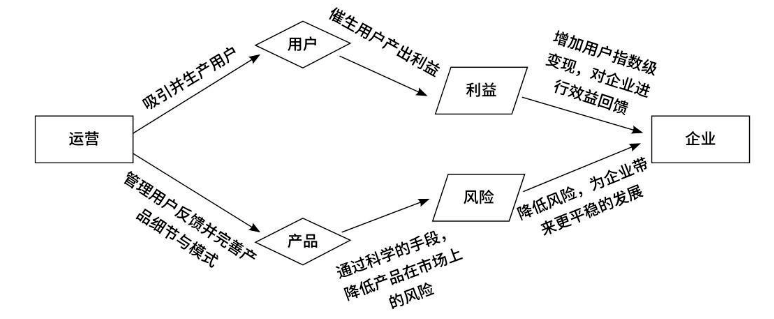
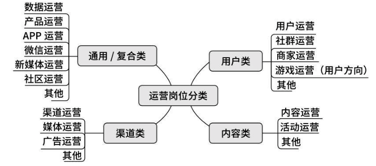
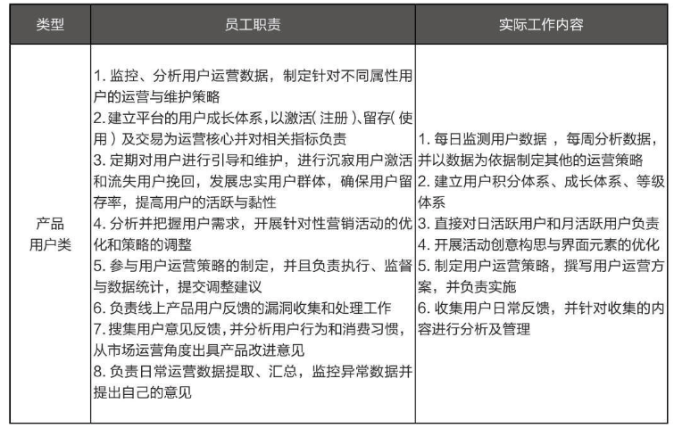
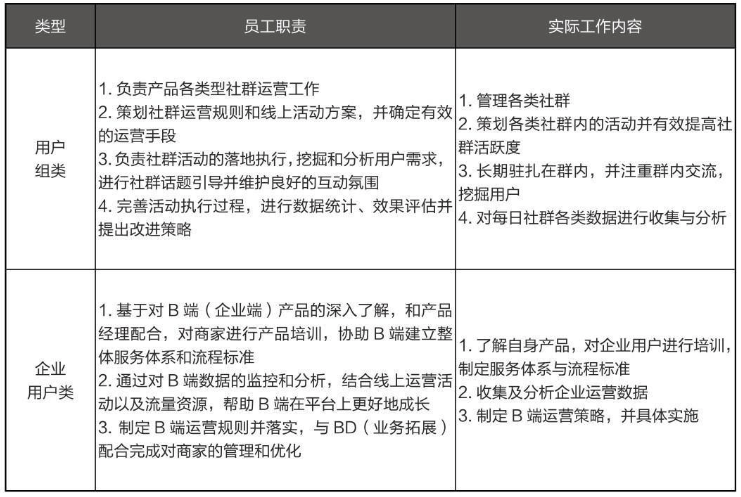
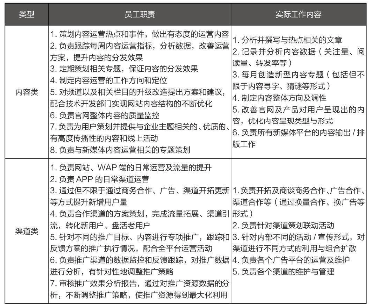

# 各大运营职能

## 运营是什么？
运营是指一切可以帮助实现产品及用户利益最大化，企业及产品风险最小化的行为。

## 运营的分类
> 产品运营
>

> 内容运营
>

> 活动运营
>

> 用户运营
>

### 职责

 

用户类运营的具体员工职责如下。

● 深入了解自身产品/服务，并对产品/服务的改善有自己的想法。

● 负责建立用户的成长体系、积分体系、消费体系、权限体系。

● 负责所有与用户相关的社群、部落等群组的运营与维护。

● 制定针对各类用户不同的维护手段与运营策略。

● 负责收集并分析用户所有的反馈及建议。

● 每日整理用户数据并进行针对性分析。

