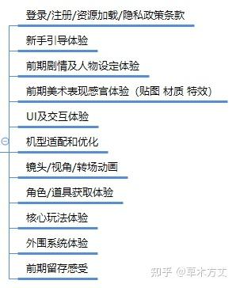

本文主要是大致记录下一款游戏从立项到上线期间，作为游戏运营（即自研项目的运营），都要做些什么工作？因为涉及到的工作环节较多，所以本文无法针对每个小的工作模块讲的足够透彻，也只是蜻蜓点水一笔过，所以肯定会有不少纰漏，这是一个遗憾。但是我们可以结合大的框架一起探讨每个小模块的工作如何做，如何才做得好。  
本文包含一些经验教训或者看别人踩的坑。尤其是4.3部分和4.2.⑦的案例。

  

## 一、立项期
这个阶段一般的小运营是不会介入的，有的运营大佬可能会介入讨论，所以这部分不涉及太多运营执行工作。

  

## 二、早期研发阶段
### 2.1 调研/建议输出
这部分主要是需要针对已初步确定的立项提案，做以下工作：

一般团队做的产品都不太会是品类鼻祖，所以大多数产品其实在立项后就能在市面上找到基本上品类相同的“竞品”可以参考，所以这个时候我们可以先大致了解下同类产品的核心玩家、商业化体系大致的结构、一些简单的运营策略、玩家关注的点和容易吐槽的点在哪儿，提前有个数。

其次如果这个时候大致确定了这款产品将来会是主要发国内？还是发海外某个地区？还是发全球的策略，可以大致了解一下对应地区玩家的一些偏好、文化差异、市场相关数据等。其实也算是本地化运营中的一些小经验，诸如：

①.我们国家和信奉伊斯兰教地区的一些文化差异？

②.东南亚地区的付费能力相较欧美地区普遍差一些

③.东南亚地区的玩家由于上班很多都是骑电瓶车，所以并不像我们国内玩家还有所谓的上下班路上乘坐公共交通工具的碎片化时间

④.东南亚的玩家常用机型大多数都为大概几百-一两千的安卓机，适配是大问题

⑤.东南亚玩家充值还有用短信支付、话费支付、和去超市买储值卡的方式

⑥.韩国玩家普遍的每月1号发薪日

有很多花里胡哨你想不到的差异化……

  

结合以上的一些调研分析，加上我们运营对于游戏常见玩法和套路的基本认知，可以一个项目研发阶段给予策划同学一些可适当参考的设计建议或者加入玩法策划讨论。

  

### 2.2 运营需求输出
虽然还处于项目早期研发阶段，但这个时候我们已经要开始着手准备我们的一些运营需求了，然后给到PM去进行排期，包括一些客户端、服务器同学在有空的时候也可以开始将这些需求加入到他们的功能代码底层设计中去，有空就可以提前先做着。其中主要包含三大块：

①.GM工具的需求。诸如我们的管理后台、用户信息管理功能、公告系统、跑马灯、邮件、问卷、各种广告弹窗功能。

②.数据打点需求。比如我们项目接入数据平台需要做的数据上报，需要上报哪些事件？上报事件的定义等等。

一些通用事件打点

基础事件打点示例

③.活动需求。诸如要做的一些基础的七日签到活动、大图分享活动、月签到活动、其他的基础活跃活动等（此处的活动暂不包含付费活动，诸如首充，月卡等，后面会提到）。

  

### 2.3 账号搭建工作
①.各大社区平台页面搭建（tap、b站、好游快爆等），新媒体账号创建及认证（微博、b站、fb、tw等），官方Q群搭建

②.官网搭建

③.各大应用商店开发者账号创建，获取各种参数，诸如：app id、app secret、调用分享参数、调用支付参数等

  

### 2.4 大致的宣发思路整理
比如我们项目的核心卖点，可以去谈的一些联动ip，之后发行的时候可以去蹭哪些热点，投放主打哪些平台（广点通？头条系平台？微博信息流？FB？google？），投放素材的大致风格等等。

  

### 2.5 确定宣发期的美术视觉规范
前面提到了我们投放素材的大致风格梳理，这个时候也可以适当开始商议我们项目在宣发时，对于美术视觉规范和资源的使用规范。因为项目上线前后宣发期间，必然会涉及到很多宣发素材的制作，涉及多方对外合作，无论是我们自己还是合作方在制作宣发素材时，如何才能保证我们品牌的规范性和统一性。这一块需要商议的主要包含以下部分：

**品牌概念：**这是一个偏文字阐述性的内容，代表了我们品牌想要表达的内涵，用于后续统一我们共同的价值观和审美标准。

**logo基础型：**最常使用的logo版本

**标志标准制图：**为确保标志在不同应用中的准确和统一性，需要参考我们官方给出的结合网格的制图范围标准

**标志标准色：**为确保标志全彩使用时色彩的统一性，需要遵循官方给定的专用标准色值进行使用

**单色标志及特殊色：**如因特殊色、工艺、场景、视觉清晰度、合作品牌等原因需要使用单色、纯色logo的使用标准

**标志底色应用限制：**标志在底色明暗对比使用中的限制规范

**标志最小应用尺寸：**标志使用时可按标准比例无限放大，但需遵守最小尺寸应用要求

**错误应用案例：**由官方设计师给出的一些明确不希望出现的错误设计案例

**合作品牌组合规范：**当标志与合作品牌并列使用时，需要遵循的页面网格规范，以保证内容相对独立清晰

**横版标志标准制图：**不同形式（横版/竖版）logo的使用标准

**版权标志及版权信息：**主要是版权注释的最小应用字号（©2010-2015 某某游戏. All rights reserved.）

  

### 2.6 项目资质/版权相关
①.项目名称（包含多语言）、logo相关标志信息的版权抢注，宜早不宜晚

②.相关账号开发者资质申请（如apple开发者账号、谷歌开发者账号等）

③.版号申请资料筹备：这个时候可以大概开始做一些申请版号的资料撰写了，只是这个阶段还没有送审版本，可能很多需要截图、录屏的内容还暂时无法完成

（*对非业内同学提示一下：游戏行业的版号是比命还重要的资质，由国家相关机构负责审核派发，如果没有版号，则无法在国内开启付费测试和公测，也就是说不能赚钱）

**游戏申报期间务必做到以下几点，否则游戏通过不了**

1. 游戏登录页面和加载页面必须有《健康游戏忠告》：抵制不良游戏，拒绝盗版游戏。注意自我保护，谨防受骗上当。适度游戏益脑，沉迷游戏伤身。合理安排时间，享受健康生活。  
2.使用的地图，不要和实际相符，请虚拟化，不要出现海岸线。  
3.不要出现暴露女性。含胸罩、三角裤或乳沟过深。  
4.不要出现“杀死”、“砍死”、“斩杀”、“猎杀”等暴力字眼，请使用和谐字眼，如打败、消灭、打垮等。  
5.不要出现奴隶系统、劫镖系统、仇人系统、盗墓等青少年不良导向的系统。  
6.不能出现和人民币直接挂钩或间接挂钩的有几率道具或事件。如：开宝箱、快乐大转盘、打孔、装备洗练与强化等。（但可以用副本任务产出的免费游戏币来博几率）  
7.不要出现血腥场面。打怪出现红色血迹和喷洒场面。  
8.不要出现名牌商标名称、名人姓名等事件。  
9.不要出现猎杀保护动物，老虎，狮子，熊等，或者获取虎皮，熊胆等东西。  
10.不要出现过于阴暗面的词汇，如亡灵，亡魂，魂魄，尸体等。  
11.不要出现近代真实事件和人物，如二战等。  
12.游戏玩家可以打字的地方必须屏蔽敏感词，含角色起名、聊天、邮件…

  

④.《移动游戏技术评审标准与实践案例》，这个运营同学大概看一下有个数就行，作为对版本质量把控的参考标准

[2018腾讯移动游戏技术评审标准与实践案例-腾讯游戏学堂gameinstitute.qq.com/tech-ebook](https://link.zhihu.com/?target=https%3A//gameinstitute.qq.com/tech-ebook)

  

## 三、核心玩法初具雏形
### 3.1 组织团队内部测试
这个环节主要是由运营组织，让公司内部的同事或者小团队内部的同事（非核心开发成员）加入，通过内部成员小规模集体测试的方式，对目前阶段产品的核心玩法、美术表现、相关机制进行“玩家”体验调研，同时验证一些还未发现的产品问题，收集相关反馈。

这部分的工作主要包含以下部分：

①.制定人员筛选策略并选人。比如我们想选核心玩家还是非核心玩家？想找玩过这个玩法的玩家还是完全没接触过这个玩法的玩家？然后根据我们的策略和需求选出对应数量的同事单独拉个测试群进行下一步沟通

②.签订保密协议（这个视团队情况而定，我们领导当时会要求参与人员签订保密协议以确保内部测试版本不会外泄）

③.制定测试形式。偏PVE或单机玩法的游戏可以直接丢版本给其他同学玩，玩了提意见。偏PVP的竞技游戏诸如MOBA等需要对抗的游戏，这个阶段一般也还没有足够成熟的AI，所以单人很难体验到核心玩法，这个时候我们组织一个小型比赛的形式，让大家既参与了测试也能有一定趣味性。

④.体验答疑。大家在体验我们的测试版本时，一定会对于游戏体验和操作有不少疑问，这个时候我们可以让负责策划相应系统的同学都加到群里，随时为大家解答一下。

⑤.反馈建议收集。开始测试体验前，我们运营需要准备好一个在线文档，以供大家在体验的时候如果有遇到什么bug反馈或者建议，能立即找到一个地方输出，并且可以多人协同。

⑥.体验结果调研。测试结束后，我们需要准备一个小小的调查问卷，包含对于大家体验后的一些基础感受调研，以及策划同学明确想知道的部分功能的反馈进行感受调研。

⑦.测试总结报告输出。对于本次测试整体的来龙去脉，过程，调研分析结果，大家的反馈建议，需要有一个汇总报告，同步给相关同事。

  

### 3.2 提审版号
这个阶段正常情况下应该已经有了送审版本，前面已经撰写了一些提审材料，这会儿有了送审版本后，就可以完成剩余的一部分截图、录视频需求，差不多准备一下就可以送审了。

  

### 3.3 继续版本开发和调优
结合给同事玩了后的反馈建议 以及 本来的开发计划，这会儿就继续进行后续的版本开发。

  

## 四、第一次见玩家的版本
当项目到了可以第一次见玩家的版本完成度时，这个阶段我们就要开始筹备我们的对外测试计划了

### 4.1 测试版本的运营体验
这部分主要是运营需要花点时间好好体验一下要用来测试的这个版本，当然这个时间点会更提前一点，提前到这个版本刚内部打包出来的阶段，而不是在马上要测试的阶段。

体验的核心目的是要着重关注新手引导部分和前提体验，尽早发现测试版本的问题，并提出优化建议，推动优化改进。需要关注的几个部分主要是：

除此之外，视各个项目本阶段测试的调性和风格，决定是否需要准备本次测试的FAQ文档。（有的就是给玩家玩不做疑问答复，有的会提前做好相关常见问题的答复准备工作，尤其是一些非游戏性之外很敏感的问题答复口径）

  

### 4.2 确定测试计划
<u>*测试计划不完全由运营制定，因为涉及到很多发行合作协议、和渠道的商议结果等由公司老板或商务老大去谈的细节，所以整个测试计划的大方向需要由知道相关信息的人来制定。</u>

①.**测试目的**：一般来说“不计费限号删档测试”的核心目的是测核心玩法和美术表现，主要是测玩家的初期留存。

②.**测试目标**：目标也基本会围绕着前几天的留存数据来制定。

③.**测试渠道**：想下我们计划在哪些渠道进行测试，比如tap、b站、好游快爆，测试上不上IOS版本？（IOS版本需要用testflight）

④.**测试时间**：从多久测到多久，多久开始测？一般是老板拍板（一/二测一般就3/5/7天，这个阶段版本内容不够玩家玩太久，主要为技术测试，版本完成高的可能会测个两周左右，看看十四留）

⑤.**测试类型**：这会儿基本上是“不计费限号删档测试”，没什么疑问。

⑥.**限号数量**：允许多少人参与测试？

+ <u>哪个渠道的测试名额比哪个渠道的测试名额多或者少，是有讲究的，渠道很在意</u>
+ <u>发多少号出去，最终真的会进来创角的人有多少，可以按70%-80%的转化率来算。使用这个比例计算的前提是运营工作做的要够好</u>

⑦.**限号方式**：一般来说是用账号白名单的方式。但也有同行喜欢玩骚东西最后出事儿的，这里分享一个案例。

+ 常规做法：投放测试报名问卷，官方筛选抽取指定人群，根据手机号或渠道账号开账号白名单（只允许这些账号进入测试版本）
+ 也有做法：发激活码（可能会有倒卖现象拉爆舆情）
+ 同行的骚做法：让玩家自己去抢，根据注册创角顺序发放测试名额，名额满了就关闭下载和注册。（也许初衷真的是由他们所说想公平，防止激活码倒卖，但结果是翻车的，经验还是不足）

虽然想笑，但是也很同情他们那一天一定很忙

该团队吸取教训，后续测试调整限号方式

⑧.**测试资格通知方式**：官网预约的一般是走短信或邮件。tap和b站这些渠道预约的就走他们的站内信通知。

⑨.**测试报名问卷制作和投放**：根据运营制定的筛人规则制定响应问卷即可，需要包含一些基础信息（性别/年龄/职业/使用设备/游戏时长），加一些偏好信息（最近常玩游戏类型/对游戏喜爱的偏好/游戏经历等）。其中如性别，年龄，职业这些偏隐私信息，放在最后问，不要在开头问，这是基本的问卷制作常识。

⑩.**渠道沟通和资源位申请**：要和合作的渠道沟通好我们的测试计划，然后提前申请在渠道的推荐资源，这样才能在我们开测的时候有足够多的玩家关注到我们的游戏并加入测试。

⑪.**相关物料制作**：各个渠道的宣发需要用到不同风格、不同尺寸的KV或者PV，我们需要根据对应的需要去找美术团队和视频团队完成对应素材制作。

⑫.**社区宣发排期及内容制作**：由负责社区运营的同学制定整个开测前后这个期间，我们官方社区的宣发计划并完成相应内容制作。

⑬.**测试包渠道提审**：根据制定好的工作时间节点，督促开发团队按时给到我们终包去渠道提审。这样开测以后才能才诸如b站、tap这些渠道下载到我们的客户端。

⑭.**开预下载**：一般测试开服前一天开启预下载，也有提前两小时的，这样玩家可以下载好几个G的游戏，开服直接玩。优化玩家体验。

⑮.**删测活动筹备**：这里一般指社区活动，游戏内的活动是另外一条线。这里的删测活动主要是玩家开始测试以后可以在社区参加的一些活动， 诸如建议反馈收集活动，话题活动，晒图活动等。

⑯.**删测奖励制定**：删测是否制定奖励也是需要考虑的一件事，比如测试期间通关多少，达到多少级，连续登录多少天，是否给玩家什么限定头像框奖励或者礼包奖励等。这个奖励需要慎重考虑，因为第一次测试给了，玩家大概率会期待第二次也有，甚至期待更好的奖励。这样容易被玩家舆情给绑架了。

⑰.**关注预约数变化**：后面会提到，我们在确定了测试计划后，需要搭建好相应的预约页， 这里的预约页是指公测的预约。（有的项目开预约会更早一些）

  

### 4.3 限号测试的经验总结
①.例如tap这些渠道投放报名问卷时，一定要记得设置“指定客户群组可填写”，也就是必须先登录账号后才可填写，否则无法获取到玩家的渠道openid，这样就会导致我们无法通过渠道openid分清楚谁是谁，无法做站内信消息通知，**也无法做限号下载！**尤其是限号测试但是无法做限号下载，这样会出现玩家明明没有测试资格却下了2个G的游戏，登录时才发现没资格玩不了，会瞬间暴跳如雷来给打个1分差评，影响十分十分恶劣！

②.分渠道测试，就一定要记得对各渠道包做渠道标识区分，否则玩家的数据上报也无法分渠道查看，对于后续数据分析时的影响会非常严重。

③.如果要通过testflight做IOS测试，尽量做一个简单易懂的testflight使用教程，这样能有助于提高测试期间注册→创角转化率。

④.通知测试资格的时间和通知预下载方式的时间可以合并在一起，这样能有助于提高测试期间注册→创角转化率。

⑤.测试渠道包交付渠道提审的时间别压的太极限，否则有可能出现开测了，渠道包还没过审，玩家根本下载不了游戏。

⑥.不要低估和渠道对接会耽误的时间，对方作为渠道，可不止只服务于你这一款游戏。

⑦.对于一些由渠道负责的重大配置一定记得自己亲测，比如由渠道开启的渠道账号白名单，渠道告诉我们是OK了，但我们自测的时候发现白名单并未开启，还好检查及时，避免了出现限号测试但谁都能进的重大事故。

  

### 4.4 预约页/测试页搭建
预约页搭建的时间节点不同项目情况不同，有的项目会更早搭建，有的项目会在第一次测试计划确定后再搭建。主要包含tap、b站之类的平台开启预约功能，官网自己的预约页上线等。

测试页面也主要是指tap、b站这些平台，因为他会分一个正式页面和一个测试服页面。

某游戏正式服页面

某游戏测试服页面

  

### 4.5 参加线下展会预热
有的项目尤其是一些二次元项目，就比较适合在这个阶段参加一些线下展会（如果有的话），打一打自己品牌的知名度。

线下展会的专项筹备工作也会归到运营工作部分（如果没有专门的市场部门的话），这部分的筹备工作也是一大坨事情，非常累非常考验执行能力、线下的统筹协调能力、物料制作筹备能力，这一部分都值得单独讲很多东西。

  

### 4.6 美术素材投放测试
这个阶段也是可以拿一些项目比较精致的美术素材拿去做一些简单的投放测试（包括外），可以初步了解一下这个项目的美术风格吃不吃玩家，吃哪些受众。

  

## 五、不计费限号删档测试
前面已经讲完筹备工作，这部分主要讲测试开始后和结束后运营需要做的工作。

不计费限号删档测试主要是测核心玩法+美术表现，主要测留存数据。

不计费限号删档测试一般情况下可能会有一次、两次、三次，都有可能。视团队情况而定。

**测试期间：**

①.需要通过社区、客服、收集活动等多个方式，收集玩家在测试期间的各种反馈和建议并提炼有效内容。

②.有问题可能会需要紧急更新（热更或换包）

③.<u>关注数据变化</u>（核心留存数据、“下载-激活-创角-进游戏”的转化率、DAU、A/PCU、在线曲线与在线时长、副本关卡进度、等级分布与驻留、货币/道具资源消耗情况、抽卡参与情况等）

④.按日报甚至更高频率的方式向项目组小伙伴同步数据情况（需要看每个团队对数据保密性的要求）

**测试结束后：**

<u>*要从主观+客观多维度的方式去了解玩家对于本次测试版本的体验和评价。</u>

①.【主观】玩家测试体验调研问卷（一般在测试期间投放在游戏内）

②.【主观】各大社区玩家舆情总结提炼

③.【客观】测试期间玩家行为数据分析报告

④.整理收集到的各种建议，并提炼真正有效的版本调优建议

⑤.整个测试期间运营团队的工作总结复盘（尽量别有运营事故）

⑥.GM运营工具及数据平台的问题总结并优化（测试期间使用过程中遇到的问题整理，提优化需求，以便下次测试时使用方便）

  

## 六、确定后续付费测试计划
这部分的事情其实在上次不计费限号删档测试结束后就已经可以开始筹备了。

①.我们项目的付费调性调研及活动类型调研

先说付费调性，之所以要研究这个东西，是因为不同品类的项目在做付费的时候，方式、力度都有所不同。有的品类的玩家你用点力骗氪，他也能接受。有的品类的玩家尤其是二次元品类，骗氪力度太大会引起极强烈的抵触情绪，从而引发大片的负面舆论和低分评价。

比如明日方舟、原神、战双帕米什、白夜极光、崩坏3这一类产品都没有大月卡一说，好些也没有成长基金、周期性的累计充值，这个品类的玩家无非也就是这一大波，大家玩来玩去已经形成了固有认知，如果你的运营方式超出了他们惯有的认知，那就等着挨喷吧。

其次比如说大多数三次元的产品都有首充活动，这司空见惯，没觉得有什么问题。但主流二次元产品的做法是购买首充礼包，并不是单纯的首次充值。该类型的游戏也并没有在商城里投放各式各样数十种不同类型的资源礼包，在售卖礼包的数量上也是极度的克制。这些都是不同品类游戏在商业化运营上需要讲究的部分。需要遵循这个品类固有的一个不成文规则，这样才能一定程度上提高玩家的认可和喜爱度。

②.明确了付费测试活动计划后，就是提相应的活动需求并跟进落地。

③.这个阶段运营需要抓着版本着重体验和调优的重点是：付费活动设计和付费道具投放等与付费体验相关的问题，确保在付费测试开始时的版本在这方面没有明显的重大设计缺陷。

  

## 七、计费限号删档测试
①.计费限号删档测试主要是玩家前期的付费情况，是否符合我们的设计预期，也可以大概了解下这个产品当前版本的拉收能力。

②.计费限号删档测试可能会有一次、两次。单次一般就是测一周或者两周。

③.这个阶段是需要重点关注付费率、arpu值等相关的付费数据和付费流失数据，当然留存数据也还得重点关注。

④.需要确定好内测期间的充值在公测期间的返还规则。返还规则一般是以倒梯形设计呈现，越高档的金额返还比例会逐级降低。

任意截取一款游戏示例

⑤.其余部分工作和之前“不计费限号删档测试”阶段一致，就不重复提及了。

⑥.针对本次测试情况进行总结，整理版本调优建议，继续后续的版本开发调优。

  

## 八、公测前阶段
在前面所有工作阶段都完成且所有数据符合预期，发行计划如常推进的情况下，这个阶段就是重点筹备正式公测的工作了。（一般来说这个阶段都会特别特别忙，因为版本的进度不会那么如期的，甚至还在加班加点赶版本进度）

①.制定公测宣发计划，制作各种物料（五图素材+ICON+KV+PV+PR稿之类的）

②.制定各种公测活动（游戏内+社区+各个渠道+线下）

③.和渠道勾兑好开服计划，定好推荐位资源（这个非常重要，当然这些合作很多也不是靠小运营能用嘴谈下来的，都是大佬py的）

④.和相关合作的游戏媒体提前谈好宣发合作

⑤.验收公测版本、服务器稳定性、运维等基础支撑资源，协调好平台同学做好各个功能模块的支撑

⑥.结合版本情况制定常见FAQ文档，方便客服同事及其他合作同事介入合作，熟悉项目。

⑦.开服期间全员最高级别关注版本运营情况

  

---

目前能想到的就这些，很多工作碍于文字说着费劲儿就一笔带过了，实际做起来是需要不少人协同和不少时间精力的。

肯定有很多漏掉的部分，之后工作中遇到了，想起来了， 再补吧。

总之想说，盘活儿一个游戏上线，运营也要费不少劲儿，就希望别误会一款游戏上线，只是研发的工作。

