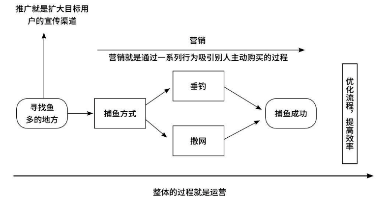

# 运营、市场、产品的关系

运营、营销、推广有什么区别？ 

● 运营：通过一切可以帮助实现产品及用户利益最大化，企业及产品风险最小化的行为。

● 营销：发现或挖掘消费者需求，以营造氛围及自身产品形态的方式推广和销售产品，从而让消费者深刻了解该产品，进而购买该产品的过程。

● 推广：为了让消费者快速了解产品而进行的一系列有目的的对外宣传行为。

通过对三者的解释，可以发现三者是运营包括营销，营销包括推广的关系，那么三者又有哪些区别与联系呢？

运营是站在整体层面去考虑产品/企业如何在运作的过程中以更加快速、安全、稳定的手段完成企业目标。而营销是站在品牌/销售的角度，以实现更多的商品效益。推广则是在营销过程中考虑如何达到最大化的对外宣传程度，以更全面地覆盖多数目标用户。

以捕鱼为例，我们捕鱼的方法有很多，可以垂钓，也可以撒网。但无论选择何种方式，首先需要寻找鱼多的地方（推广），然后使用垂钓或撒网（营销）的方式捕鱼。在此过程中，寻找鱼多的地方的成本与效率、制作鱼饵/撒网的成本与效率的合理运用过程即运营

